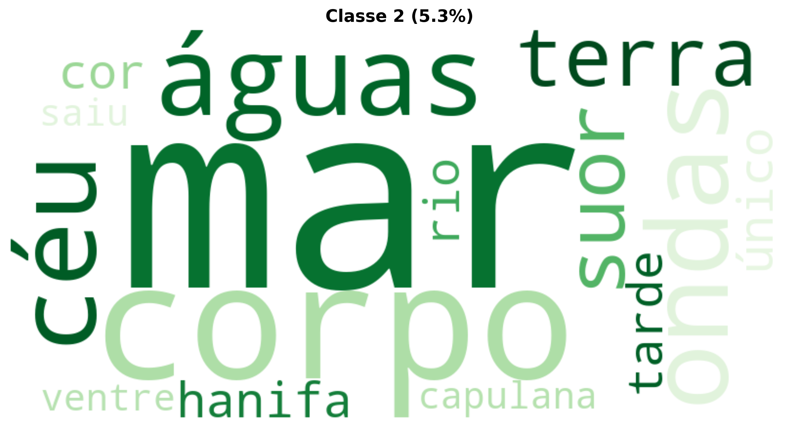

# Relatório de Análise Textual Avançada: KhosaUBK_OrgiaDosLoucos_OCR

Este relatório apresenta uma análise linguística e estatística abrangente da obra, utilizando técnicas avançadas de Processamento de Linguagem Natural, Machine Learning e o **Método Reinert** de Classificação Hierárquica Descendente (CHD), seguindo os padrões do software IRaMuTeQ.

---

## Método Reinert - Classificação Hierárquica Descendente (CHD)

O Método Reinert (1983, 1991) é uma técnica estatística de análise lexicométrica que identifica automaticamente classes lexicais homogêneas no corpus textual, revelando os "mundos lexicais" ou universos de sentido presentes no texto através de Classificação Hierárquica Descendente maximizando a estatística χ².

### Resultados da Classificação Hierárquica Descendente

| Classe | Percentual | Palavras |
|--------|------------|----------|
| Classe 6 (vermelho) | 76.1% | à, homens, águas, corpo, mulheres, noite, mãos, mar, filho, dia, morte, marido, olhos, joão |
| Classe 2 (verde) | 5.3% | mar, corpo, águas, ondas, céu, terra, suor, hanifa, cor, rio, único, tarde, capulana, saiu, ventre |
| Classe 5 (azul) | 3.8% | mãos, joão, pés, negro, preto, tinha, porta, cabeça, dedos, patrão, deixou, ia, sapatos, está, sobre |
| Classe 8 (amarelo) | 3.8% | morte, à, escola, quero, mamã, sombra, contemplando, choros, cubata, deixou, manhãs, posição, rua, capulana, círculo |
| Classe 1 (rosa) | 3.5% | homens, mulheres, animais, três, crianças, avenida, escadas, filhos, olhavam, grande, serpentes, águas |
| Classe 3 (laranja) | 2.7% | noite, dia, lua, manhã, lá, primeiro, vê, momento, durante, luz |
| Classe 4 (roxo) | 2.5% | olhos, marido, rosto, quarto, passou, cadáveres, rua, sair, cama, sorriu, morto, sala, ainda, leva, séculos |
| Classe 7 (marrom) | 2.3% | filho, porque, puta, vivo, boca, sentado, ninguém, olhava, nome |

### Dendrograma da CHD

O dendrograma abaixo mostra a estrutura hierárquica da classificação, ilustrando como os segmentos de texto foram agrupados:

#### Nuvem de Palavras - Classe 1

#### Nuvem de Palavras - Classe 2

#### Nuvem de Palavras - Classe 3

#### Nuvem de Palavras - Classe 4

#### Nuvem de Palavras - Classe 5

#### Nuvem de Palavras - Classe 6

#### Nuvem de Palavras - Classe 7

#### Nuvem de Palavras - Classe 8

### Análise de Similitude

A análise de similitude mostra as relações de coocorrência entre as palavras mais frequentes:

---

## Nuvem de Palavras Geral

A nuvem de palavras oferece uma visualização das palavras mais frequentes após lematização e remoção de stopwords:

---

## Interpretação Especializada (LLM)

A análise do texto em questão, sob a ótica da análise literária e da linguística computacional, revela uma complexidade estilística e temática notável, marcada pela intensidade emocional e pela construção de uma atmosfera de sofrimento e confinamento.

---

### Análise Textual:

**1. Temas Centrais e Motivos Recorrentes:**

*   **Sofrimento e Dor:** O tema central e mais proeminente é a dor, descrita de forma visceral, física e psicológica, permeando todo o excerto narrativo. A dor é personificada ("evolui. Transpira. Morde os lábios.") e associada a uma agonia quase mística, que transforma e desumaniza o corpo.
*   **Perda de Liberdade e Confinamento:** O texto inicia com a declaração de que "a única forma de liberdade permitida é a loucura", estabelecendo um pano de fundo de opressão. A personagem principal está fisicamente confinada a um quarto, mas também presa dentro de seu próprio corpo e de sua dor, sem poder gritar.
*   **Vulnerabilidade Humana e Fragilidade da Felicidade:** A epígrafe inicial sobre a felicidade "frágil" e ameaçada por "fantasmas" ou por forças externas ("homens ou as circunstâncias") universaliza a condição da personagem, conectando sua dor individual a uma condição existencial mais ampla.
*   **Trauma e Memória Fragmentada:** As lembranças da infância e adolescência surgem como vislumbres fugazes, distorcidos e sufocados pela dor, sugerindo um passado traumático ou a incapacidade de escapar do presente opressor através da memória. O "baque contínuo, incessante" funciona como um gatilho de ansiedade ou uma manifestação física do trauma.
*   **Desumanização e Metamorfose Corpórea:** Há uma constante transformação do corpo e do ambiente em imagens animalescas ou geológicas: lençóis como "serpentes na muda interminável", poros como "grãos de milho", suor como "formigas emergindo dos casulos" ou "cascatas doentias". Essa metamorfose reflete a alienação e a perda de controle sobre o próprio ser.
*   **Isolamento e Incomunicabilidade:** A incapacidade de gritar, a tentativa frustrada de pensar na mãe, e a superficialidade do diálogo com o marido sublinham o profundo isolamento da personagem. A sua experiência é intransferível e inexpressável.
*   **Ironia:** O título "O PRÉMIO" (em maiúsculas) é fortemente irónico, sugerindo que o "prémio" da personagem é a própria dor, o sofrimento ou uma condição de vida miserável.

**Motivos Recorrentes:**

*   **O Corpo:** Objeto central da descrição, com foco intenso em suas sensações, fluídos (suor) e transformações.
*   **Animais:** Serpentes (perigo, transformação), camaleões (adaptação, lentidão), formigas (infestação, movimento incessante).
*   **Confinamento Espacial:** Quarto, cama, lençóis.
*   **Fluídos Corporais:** Suor, lágrimas (implícitas), a ideia de "fios de água".
*   **Tempo:** A dimensão do tempo é distorcida, com referências a "sem idade", "fim dos tempos", "pré-históricos", "idade dos dinossauros", sugerindo uma dor atemporal e primordial.
*   **Som e Silêncio:** O "baque contínuo", o "silvo mortal da serpente" contrastam com o grito sufocado e a incapacidade de falar.

**2. Estilo Narrativo e Características Linguísticas:**

*   **Ponto de Vista:** Terceira pessoa limitada, focando na experiência interna e subjetiva da personagem principal. A narrativa imerge o leitor em suas sensações e percepções.
*   **Registro Linguístico:** Predominantemente culto e poético, com uma densa camada de figuras de linguagem que elevam a intensidade da experiência.
*   **Uso Abundante de Figuras de Linguagem:**
    *   **Metáforas e Símiles:** Constituem a espinha dorsal da descrição, criando imagens vívidas e frequentemente perturbadoras (e.g., "lençóis dobram-se, tomam a forma de serpentes na muda interminável", "suor que escorre pelo corpo como formigas emergindo dos casulos").
    *   **Personificação:** A dor é personificada, ganhando agência própria ("A dor evolui. Transpira. Morde os lábios.").
    *   **Hipérbole:** Intensifica a descrição da dor e das sensações ("poros que crescem e tomam a dimensão de grãos de milho", "gotas enormes").
    *   **Anáfora e Paralelismo:** A repetição de estruturas sintáticas e termos ("Não pode gritar, tem que aguentar. Cerra os dentes...") confere ritmo, urgência e fatalismo.
*   **Linguagem Sensorial:** Forte apelo aos sentidos, especialmente tato, visão e audição, para transmitir a crueza da experiência (e.g., "dedos empapados de suor", "o som, o baque contínuo", "silvo mortal da serpente").
*   **Verbos de Ação e Sensação:** Alta frequência de verbos que denotam movimento, transformação e percepção interna (vagam, sobem, descem, range, transpira, morde, sufoca, cerra, agarra, escorre, percorrem, dançam, brincam, atiram-se, fecha, sente, imagina, vê, ouve). Computacionalmente, a análise desses verbos pode revelar a dinâmica interna da personagem e a intensidade do foco narrativo.
*   **Pontuação:** O uso de vírgulas para encadear descrições detalhadas e a ausência de parágrafos extensos na descrição da dor criam um fluxo de consciência denso, sem pausas claras, mimetizando a natureza sufocante da experiência.
*   **Dicotomia Poético/Prosaico:** Alterna descrições altamente poéticas e metafóricas da dor com a brusca irrupção da realidade prosaica através do diálogo com o marido.

**3. Contexto Cultural e Social Evidenciado:**

*   **Sociedade Opressiva:** A frase "No meu país a única forma de liberdade permitida é a loucura" aponta para um contexto de repressão política ou social, onde a dissidência ou a expressão genuína são tolhidas. A universalização da "vítima da nossa condição" amplia essa crítica social.
*   **Papéis de Gênero:** A personagem central é uma mulher, e o sofrimento descrito pode aludir a experiências femininas específicas, como o parto, a violência doméstica, ou outras formas de dor silenciada e minimizada pela sociedade. O marido, embora preocupado, parece alheio à profundidade da agonia dela, reforçando um possível isolamento de gênero.
*   **Alienação e Desconexão:** A cena do quarto e a interação com o marido, contrastando com a percepção do mundo exterior "conversando, rindo," enfatiza a profunda alienação da protagonista de seu entorno social e da normalidade da vida cotidiana.

**4. Elementos Culturais ou Históricos Evidentes:**

*   **Identidade Geográfica:** A menção a "Dezassete e trinta" (17:30h) para a hora, e a palavra "parquete" (piso de madeira), são usos comuns no português de Portugal e de alguns países africanos de língua oficial portuguesa, sugerindo uma origem lusófona europeia ou africana do texto.
*   **Trope da Loucura como Liberdade:** Este é um conceito literário e filosófico recorrente em diversas culturas, especialmente em contextos de regimes autoritários ou sociedades altamente normativas, onde a sanidade é vista como conformidade e a loucura como a única via para uma autenticidade ou rebelião interna.
*   **Simbologia Animal e Mítica:** A serpente como símbolo de perigo, tentação ou transformação é um arquétipo cultural e religioso globalmente reconhecido. A evocação de "vales pré-históricos" e "cordilheiras da idade dos dinossauros" remete a um tempo primordial, quase mítico, para a origem da dor.
*   **"O PRÉMIO":** O título, em um contexto literário e social, pode aludir ironicamente a reconhecimentos ou glórias superficiais em contraste com a realidade brutal da existência, ou a uma "recompensa" cruel por viver em tal condição.

**5. Particularidades da Escrita ou Estrutura Textual:**

*   **Início Fragmentado/Epigráfico:** O texto não começa com a narrativa, mas com três declarações sentenciais que funcionam como epígrafes, estabelecendo o tom filosófico, político e emocional que guiará a leitura. Essa estrutura convida à reflexão antes da imersão na experiência da personagem.
*   **Transição Abrupta:** A passagem da intensa descrição interna da dor para o diálogo com o marido é abrupta, criando um choque entre a realidade subjetiva e a objetiva. Essa quebra é um recurso estilístico poderoso para enfatizar o isolamento da personagem e a incompreensão de sua condição.
*   **Final Suspenso:** O texto termina in media res, "naquele quarto simpl...", deixando a frase incompleta e a situação da personagem sem resolução. Isso acentua a sensação de continuidade do sofrimento, a impotência e o impacto duradouro da experiência no leitor. A elipse final sugere que a descrição do quarto (ou da vida da personagem) é tão incompleta quanto sua liberdade.
*   **Densidade Lexical e Semântica:** O texto é rico em vocabulário e semântica, com cada palavra contribuindo para a construção de uma imagem ou sensação complexa. Para a linguística computacional, isso implicaria uma alta pontuação em métricas de diversidade lexical e densidade de informação por sentença.
*   **Assíndeto e Polissíndeto Implícito:** A concatenação de frases e descrições sem conjunções (assíndeto) em algumas passagens, e o uso de múltiplas conjunções (polissíndeto) em outras, contribuem para o ritmo e a intensidade da prosa, ora acelerando, ora alongando a percepção da duração da dor.

---

Em suma, o texto é um exercício de imersão no sofrimento, explorando a fragilidade da existência humana em um contexto de opressão social e confinamento pessoal. Sua força reside na linguagem poética e altamente metafórica, que, através de uma descrição sensorial intensa e uma estrutura cuidadosamente orquestrada, evoca a universalidade da dor e do isolamento. Para uma análise computacional, seria interessante mapear a frequência e distribuição das figuras de linguagem, a densidade de termos ligados a campos semânticos de dor, corpo, animais e confinamento, e as variações na complexidade sintática entre as partes descritivas e dialogadas.

---

## Análise de Sentimentos

- **Polaridade:** -0.009 (Neutro)
- **Subjetividade:** 0.391 (Objetivo)

A polaridade varia de -1 (muito negativo) a +1 (muito positivo). A subjetividade varia de 0 (objetivo) a 1 (subjetivo).
---

## Modelagem de Tópicos LDA (Complementar)

Além das classes Reinert, a modelagem LDA identifica tópicos latentes baseados em coocorrências:

Erro na modelagem de tópicos: cannot compute LDA over an empty collection (no terms)

---

## Análise de Clustering

**Cluster 1:** matia, velho, preto, joão, parede, olhar, porta, mulher, limpar, noite
**Cluster 2:** pensar, homem, dia, elevador, gritar, morte, mulher, olho, mão, grito
**Cluster 3:** luandle, dia, pai, olhar, homem, filho, barco, mulher, criança, casa
**Cluster 4:** filho, nome, terra, ouvir, escola, levar, corpo, afirmar, vida, noite
**Cluster 5:** água, administrador, lua, corpo, mão, homem, noite, correr, espaço, mar

---

## Entidades Nomeadas (NER)

### Estatísticas por Tipo de Entidade
- **PER:** 178 ocorrências
- **LOC:** 118 ocorrências
- **MISC:** 31 ocorrências
- **ORG:** 16 ocorrências

### Top 25 Entidades Mais Mencionadas
| Tipo   | Entidade   |   Contagem |
|:-------|:-----------|-----------:|
| PER    | João       |         27 |
| PER    | Matias     |         24 |
| LOC    | Luandle    |         21 |
| PER    | Maria      |         11 |
| PER    | Nyelete    |          8 |
| PER    | Pedro      |          8 |
| LOC    | Olha       |          7 |
| PER    | Luandle    |          6 |
| PER    | Kufeni     |          5 |
| LOC    | Lua        |          5 |
| PER    | Hanifa     |          5 |
| PER    | Maposse    |          4 |
| PER    | Silêncio   |          4 |
| MISC   | João       |          4 |
| LOC    | Simamba    |          4 |
| ORG    | Notícias   |          3 |
| PER    | Terás      |          3 |
| ORG    | Simbine    |          3 |
| LOC    | Quero      |          3 |
| PER    | Deixei     |          3 |
| PER    | Simbine    |          3 |
| PER    | António    |          2 |
| PER    | José       |          2 |
| PER    | Grita      |          2 |
| PER    | Crocodilo  |          2 |

---

## Estatísticas Gerais

- **Total de tokens processados:** 8,352
- **Vocabulário único:** 2,946
- **Densidade lexical:** 0.353

---

**Relatório gerado automaticamente com técnicas avançadas de Processamento de Linguagem Natural (NLP), Machine Learning (ML) e Método Reinert (CHD).**

**Tecnologias Utilizadas:** Método Reinert (1983, 1991), Modelos de Linguagem (LLM), Processamento e Análise Documental, Interfaces de Programação de IA, Processamento de Linguagem Natural (PLN), Aprendizado de Máquina e Mineração de Dados, Geração de Visualizações e Gráficos, Análise Estatística Avançada, Ferramentas de Produtividade, Análise Textual Aprofundada, Computação Paralela e Distribuída, e Estruturação de Relatórios Técnicos.

---

## Consultoria

David C Cavalcante

AI ML Engineer | Researcher Scientist | LLM Philosopher

- Email: [davcavalcante@proton.me](mailto:davcavalcante@proton.me)
- LinkedIn: [David C Cavalcante](https://linkedin.com/in/hellodav)
