# Relatório de Análise Textual Avançada: LBHonwana_NosMatamosOCaoTinhosoOCR

Este relatório apresenta uma análise linguística e estatística abrangente da obra, utilizando técnicas avançadas de Processamento de Linguagem Natural, Machine Learning e o **Método Reinert** de Classificação Hierárquica Descendente (CHD), seguindo os padrões do software IRaMuTeQ.

---

## Método Reinert - Classificação Hierárquica Descendente (CHD)

O Método Reinert (1983, 1991) é uma técnica estatística de análise lexicométrica que identifica automaticamente classes lexicais homogêneas no corpus textual, revelando os "mundos lexicais" ou universos de sentido presentes no texto através de Classificação Hierárquica Descendente maximizando a estatística χ².

### Resultados da Classificação Hierárquica Descendente

| Classe | Percentual | Palavras |
|--------|------------|----------|
| Classe 7 (vermelho) | 72.6% | cão, tinhoso, oito, vírgula, olhar, lá, senhor, coisa, qualquer, à, olhos, quim, administrador, madala, mim |
| Classe 8 (verde) | 8.4% | lá, mim, quim, professora, senhora, malta, olhar, dentro, estás, ouvir, anda, cima, goana, ficou, ginho |
| Classe 1 (azul) | 5.2% | cão, tinhoso, atirar, feridas, morrer, gostava, corda, queria, andava, brincar, isaura, matar, devagar, escola, tinham |
| Classe 6 (amarelo) | 5.0% | madala, maria, olhos, chão, filha, djimo, joelhos, olhar, capataz, aproximou, boa, tão, respondeu, pai, grandes |
| Classe 2 (rosa) | 2.6% | vírgula, oito, teassé, n, braços, massinga, rapariga, matchumbutana, terra, avançou, bom, espera, rodrigues, nhinguitimo, respondeu |
| Classe 4 (laranja) | 2.3% | à, espera, sombra, tarde, jogar, todos, casa, mãe, boca, mesa, mão, capoeira, deixou, melhor, primeiro |
| Classe 3 (roxo) | 2.0% | coisa, qualquer, pedir, alguma, outra, pessoa, olhava, queria, avançou, jovem, pensar, dentro, devia, nandito, diz |
| Classe 5 (marrom) | 1.9% | senhor, administrador, duarte, camas, poeira, galinhas, canto, escola, jogar, contar, rodrigues, veterinária, terra, disse, correr |

### Dendrograma da CHD

O dendrograma abaixo mostra a estrutura hierárquica da classificação, ilustrando como os segmentos de texto foram agrupados:

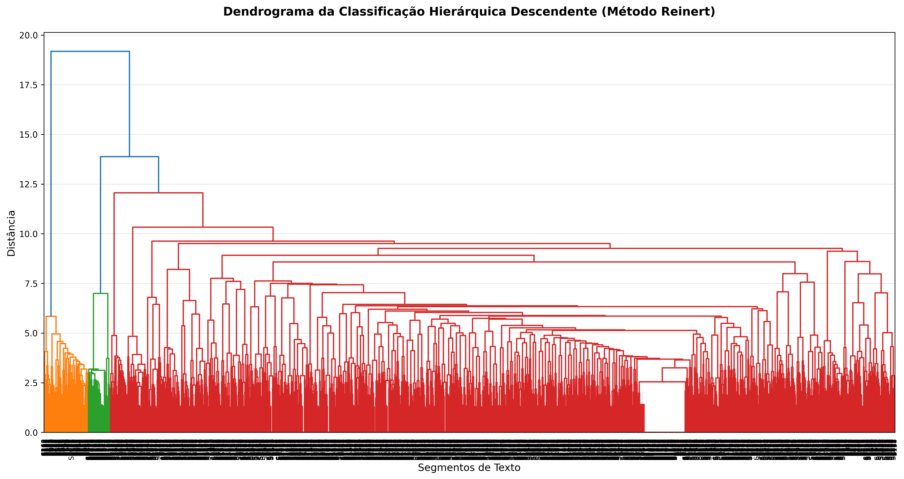

#### Nuvem de Palavras - Classe 1

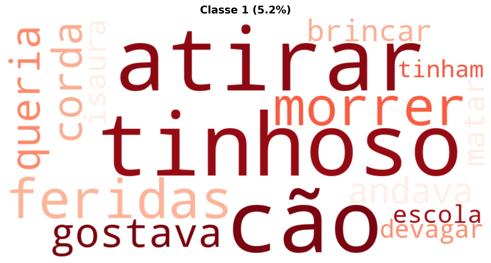

#### Nuvem de Palavras - Classe 2

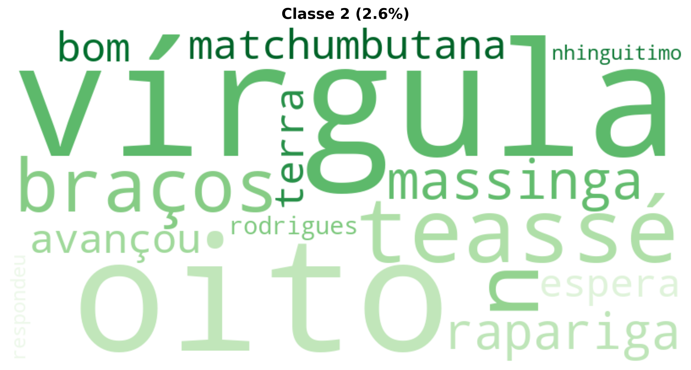

#### Nuvem de Palavras - Classe 3

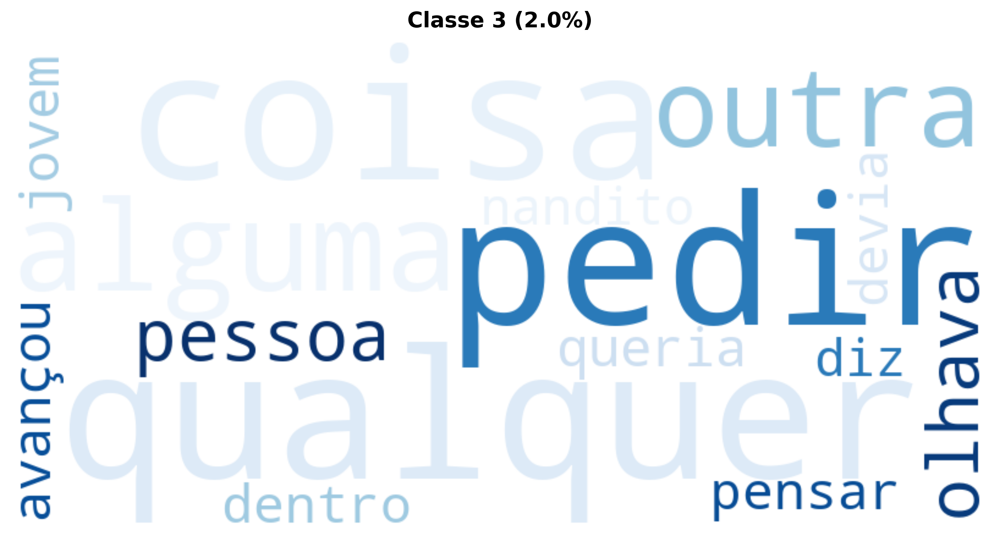

#### Nuvem de Palavras - Classe 4

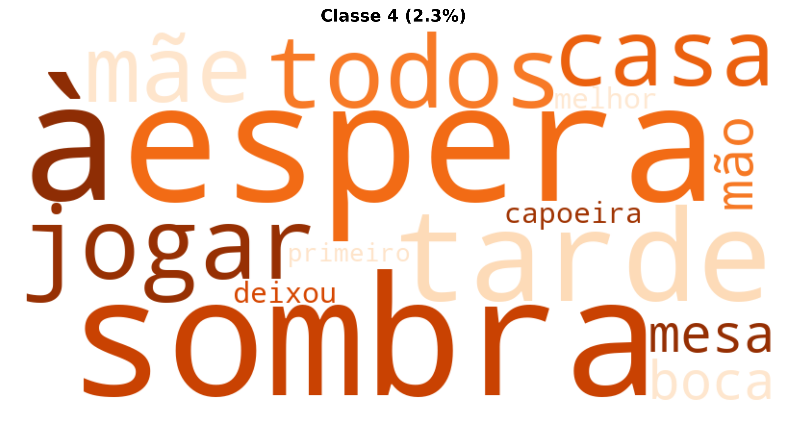

#### Nuvem de Palavras - Classe 5

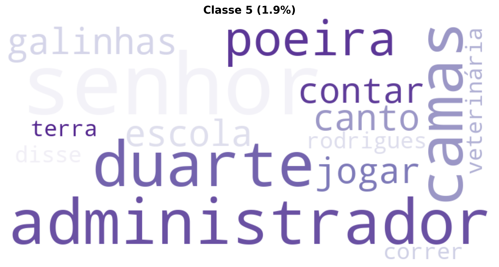

#### Nuvem de Palavras - Classe 6

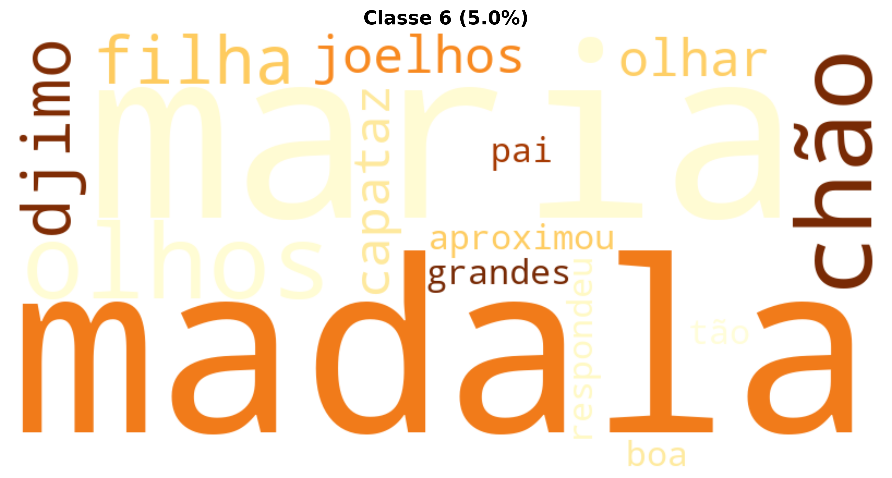

#### Nuvem de Palavras - Classe 7

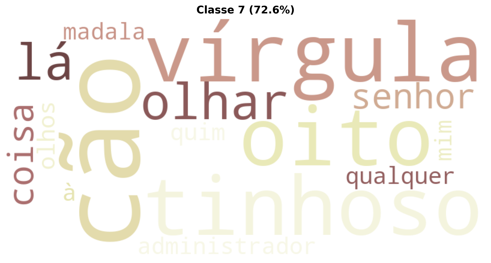

#### Nuvem de Palavras - Classe 8

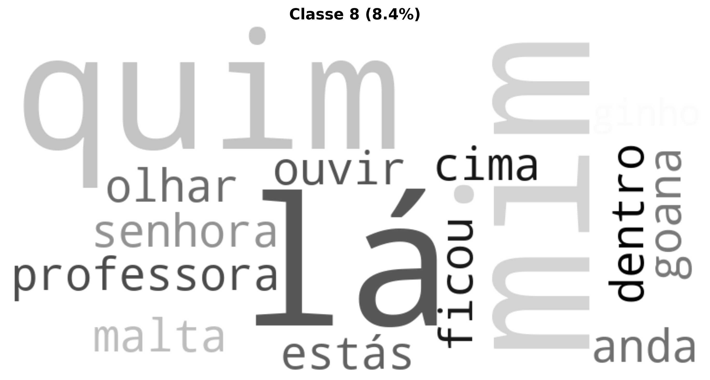

### Análise de Similitude

A análise de similitude mostra as relações de coocorrência entre as palavras mais frequentes:

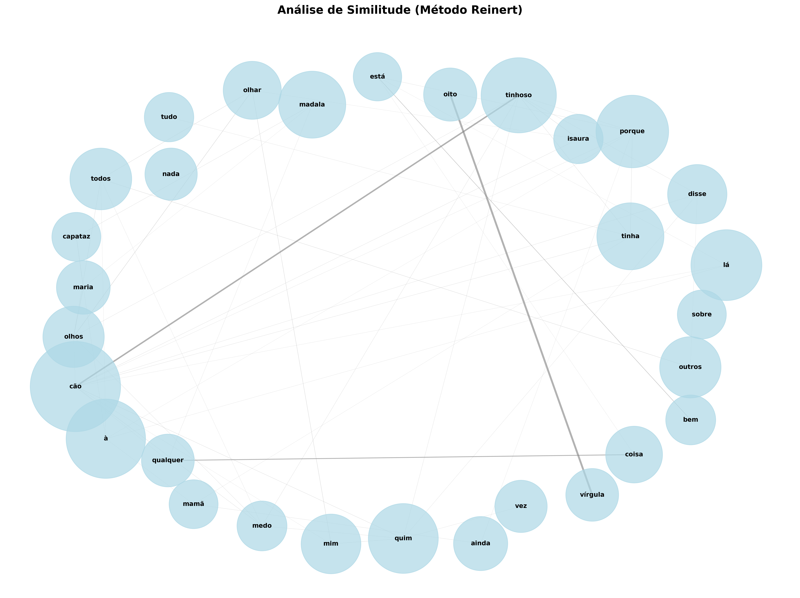

---

## Nuvem de Palavras Geral

A nuvem de palavras oferece uma visualização das palavras mais frequentes após lematização e remoção de stopwords:

---

## Interpretação Especializada (LLM)

O excerto "NÓS MATÁMOS O CÃO-TINHOSO" apresenta uma prosa rica em detalhes sensoriais e emocionais, permitindo uma análise multifacetada tanto sob uma perspectiva literária tradicional quanto através de ferramentas de linguística computacional.

---

### Análise Textual Detalhada

#### 1. Temas Centrais e Motivos Recorrentes

*   **Exclusão e Marginalização:** O tema mais proeminente é a condição do *outsider*. O Cão-Tinhoso é caracterizado por sua diferença física ("tinhoso", "ossos todos à mostra", "corpo magro", "tremer") e por sua incapacidade de se integrar. Ele é ignorado pelas galinhas, observado e rejeitado pelos outros cães, e parece viver à margem do microcosmo da escola.
    *   *Motivo recorrente:* A solidão e o isolamento. O cão está "sempre a andar devagar", "passava o tempo todo a dormir", "nunca via o Cão-Tinhoso a correr", e sua tentativa de aproximação com os outros cães resulta em recuo e medo.
    *   *Relevância computacional:* Análise de frequência de termos relacionados a isolamento ("sozinho", "sempre", "nunca"). Detecção de padrões de interação (ausência de verbos de ação recíproca entre o Cão-Tinhoso e os outros). Análise de polaridade lexical (termos que descrevem o Cão-Tinhoso tendem a ser negativos/pejorativos ou evocam piedade).

*   **Vulnerabilidade e Sofrimento:** A fragilidade física e emocional do Cão-Tinhoso é central. Seus olhos cheios de lágrimas, o corpo tremendo e os gemidos com a boca fechada são constantes lembretes de sua dor. A narrativa enfatiza a sua incapacidade de agir ou defender-se.
    *   *Motivo recorrente:* Os olhos azuis, grandes e cheios de lágrimas, descritos como "a olhar como uma pessoa a pedir qualquer coisa sem querer dizer", aparecem no início e no fim, simbolizando um sofrimento silencioso e incompreendido.
    *   *Relevância computacional:* Análise de sentimentos (sentimental analysis) para identificar léxicos de tristeza, medo, desamparo. Identificação de repetições exatas ou parafraseadas de descrições-chave (e.g., os olhos).

*   **Desejo de Pertencimento vs. Rejeição Social:** A cena dos cães brincando e a tentativa do Cão-Tinhoso de se juntar a eles é um clímax emocional. O breve momento de "cabeça levantada, o rabo direito e longe das pernas e as orelhas espetadas de curiosidade" revela um anseio profundo por aceitação, rapidamente esmagado pela hostilidade dos outros cães.
    *   *Relevância computacional:* Análise contrastiva de verbos de ação para o Cão-Tinhoso (observar, tremer, recuar) versus os outros cães (correr, brincar, cheirar, ladrar, avançar). Identificação de marcadores de mudança de estado emocional (e.g., a breve elevação da cabeça).

#### 2. Estilo Narrativo e Características Linguísticas

*   **Ponto de Vista:** Narrativa em primeira pessoa ("Eu via"), sugerindo um observador jovem ou infantil, dada a simplicidade da linguagem e o foco na descrição sensorial direta. O narrador é passivo, apenas observando e relatando.
    *   *Relevância computacional:* Contagem de pronomes de primeira pessoa. Análise da voz narrativa (passiva vs. ativa, direta vs. indireta).

*   **Linguagem Simples e Direta:** O texto utiliza vocabulário acessível, frases predominantemente curtas e uma estrutura sintática clara. A ausência de subordinação complexa contribui para a sensação de oralidade e imediatismo.
    *   *Relevância computacional:* Cálculo da legibilidade (e.g., Índice de Gunning-Fog, Flesch-Kincaid). Análise da distribuição do comprimento das frases e complexidade sintática (número de cláusulas, uso de conjunções).

*   **Repetição e Anáfora:** A repetição de descrições (e.g., dos olhos, do tremer, do andar devagar) e de ações ("correr, a correr") confere ritmo e reforça características. O nome "Cão-Tinhoso" é repetido constantemente, solidificando sua identidade e condição.
    *   *Relevância computacional:* Análise de n-gramas para identificar frases e padrões repetidos. Detecção de coreferência para "Cão-Tinhoso" e seus pronomes.

*   **Comparações e Metáforas Simples:** O uso de comparações como "a olhar como uma pessoa a pedir qualquer coisa sem querer dizer", "como os bois" e "parecia uma carroça velha" humaniza o sofrimento do animal e facilita a empatia do leitor, ao mesmo tempo que descreve sua fragilidade.
    *   *Relevância computacional:* Identificação de estruturas comparativas ("como", "parecia"). Análise semântica dos alvos da comparação para categorização de metáforas (e.g., humanização, fragilidade mecânica).

*   **Oralidade e Coloquialismo:** Expressões como "uma data de tempo", "punham-se a ladrar", "meter-se com eles" sugerem uma linguagem próxima da fala cotidiana, conferindo autenticidade e regionalidade.
    *   *Relevância computacional:* Análise de corpora para identificar a frequência de expressões idiomáticas ou coloquiais em relação a um registro mais formal.

#### 3. Contexto Cultural e Social Evidenciado

*   **Ambiente Rural/Periférico:** A menção de "galinhas do Senhor Professor", "capim", "bois" e a presença de cães vadios ou semi-domésticos em torno de uma "Escola" sugere um cenário mais rural ou de periferia urbana, onde a vida animal está mais integrada e exposta às intempéries e à indiferença humana.
    *   *Relevância computacional:* Análise de entidades nomeadas e termos léxicos relacionados ao ambiente (fauna, flora, infraestrutura).

*   **Dinâmica de Grupo e Exclusão Social:** A interação entre os cães reflete dinâmicas sociais humanas de bullying, exclusão e a crueldade da indiferença. O Cão-Tinhoso é o "diferente" que não é aceito pelo grupo, uma metáfora para minorias ou indivíduos marginalizados em qualquer sociedade.
    *   *Relevância computacional:* Modelagem de redes de interação entre personagens (ou, neste caso, animais) para visualizar a conectividade e a centralidade de cada ator. Análise de léxicos sociais (agressão, aceitação, rejeição).

*   **A Crueldade Coletiva (Implícita pelo Título):** O título "NÓS MATÁMOS O CÃO-TINHOSO" antecipa uma ação violenta e coletiva que não é detalhada no excerto, mas permeia a leitura com um tom sombrio. O texto do corpo, ao descrever a vida de sofrimento e a rejeição do cão, serve como uma espécie de "justificativa" ou, mais precisamente, um inventário das razões que podem ter levado à sua eventual morte por mãos humanas (ou por inação/negligência).
    *   *Relevância computacional:* Análise da dissonância entre o tempo verbal e a ação descrita no título (pretérito perfeito, ação concluída) e o tempo verbal e a ação no corpo do texto (presente/imperfeito descritivo, ação contínua).

#### 4. Elementos Culturais ou Históricos Evidentes

*   **Arquetipo do Pária/Cão Vadio:** O Cão-Tinhoso encarna o arquétipo universal do animal marginalizado, muitas vezes visto como um peso ou uma ameaça, mas que paradoxalmente evoca pena e compaixão. Esta figura é recorrente em diversas culturas e literaturas.
    *   *Relevância computacional:* Comparação intertextual com outros textos que apresentam a figura do "cão vadio" ou "pária" em diferentes culturas e épocas.

*   **Cenário Atemporal:** O texto não contém referências históricas específicas (datas, eventos, figuras políticas). O foco é na experiência humana (e animal) universal de sofrimento e exclusão, que transcende períodos históricos.
    *   *Relevância computacional:* Análise de entidades nomeadas para a ausência de marcadores temporais ou históricos específicos.

#### 5. Particularidades da Escrita ou Estrutura Textual

*   **Corte Abrupto e Incompletude:** O texto termina subitamente com a frase "sempre com a cabe...", deixando o leitor em suspense e com uma sensação de incompletude. Esta técnica sublinha a fragilidade contínua do Cão-Tinhoso e a falta de resolução para seu sofrimento.
    *   *Relevância computacional:* Análise da estrutura da frase final (interrupção, elipse). Detecção de padrões de encerramento em corpora para comparar com o final abrupto.

*   **Tensão entre Título e Corpo Narrativo:** A maior particularidade é a relação entre o título e o corpo do texto. O título anuncia um evento final ("NÓS MATÁMOS") que não é narrado no excerto. Em vez disso, o corpo constrói o cenário e o pathos que antecedem o evento fatal, explicando *por que* o Cão-Tinhoso era uma vítima potencial e *quem* era capaz de cometer tal ato (o "NÓS"). Esta técnica cria um poderoso efeito de presságio e ironia trágica, deslocando o foco da ação para a motivação e o contexto.
    *   *Relevância computacional:* Análise semântica da relação entre o título (uma proposição afirmativa no passado) e o conteúdo do texto (uma descrição no presente/passado imperfeito). Identificação de narrativas que empregam *prolepsis* (antecipação de eventos).

*   **Circularidade Temática e Estrutural:** A descrição inicial dos olhos do Cão-Tinhoso é quase idêntica à descrição no final do excerto, criando uma estrutura circular que reforça a persistência do sofrimento e a falta de escapatória para o animal.
    *   *Relevância computacional:* Identificação de blocos de texto ou frases semanticamente similares no início e no fim do excerto.

---

Em suma, o excerto "NÓS MATÁMOS O CÃO-TINHOSO" é uma profunda meditação sobre a exclusão e a vulnerabilidade, construída através de uma linguagem acessível, mas rica em detalhes emotivos e metáforas simples. A tensão entre o título e o conteúdo, a oralidade do estilo e a circularidade da descrição contribuem para uma experiência de leitura impactante, que pode ser desconstruída e analisada eficazmente por métodos de linguística computacional para identificar padrões lexicais, sintáticos e semânticos que sustentam sua poderosa carga temática.

---

## Análise de Sentimentos

- **Polaridade:** 0.353 (Positivo)
- **Subjetividade:** 0.725 (Subjetivo)

A polaridade varia de -1 (muito negativo) a +1 (muito positivo). A subjetividade varia de 0 (objetivo) a 1 (subjetivo).
---

## Modelagem de Tópicos LDA (Complementar)

Além das classes Reinert, a modelagem LDA identifica tópicos latentes baseados em coocorrências:

Erro na modelagem de tópicos: cannot compute LDA over an empty collection (no terms)

---

## Análise de Clustering

**Cluster 1:** madala, maria, capataz, homem, planto, djimo, madalar, mão, arrancar, olho
**Cluster 2:** mamã, papá, sartina, cobra, cama, capoeira, prato, sala, galinha, castro
**Cluster 3:** quim, malta, cão, andar, tiro, isaura, medo, atirar, matar, olhar
**Cluster 4:** olhar, miúdo, velhota, contar, comer, mão, senhor, professora, senhora, preto
**Cluster 5:** machamba, vírgular, vírgula, rola, rodrigues, administrador, terra, milho, vila, vento

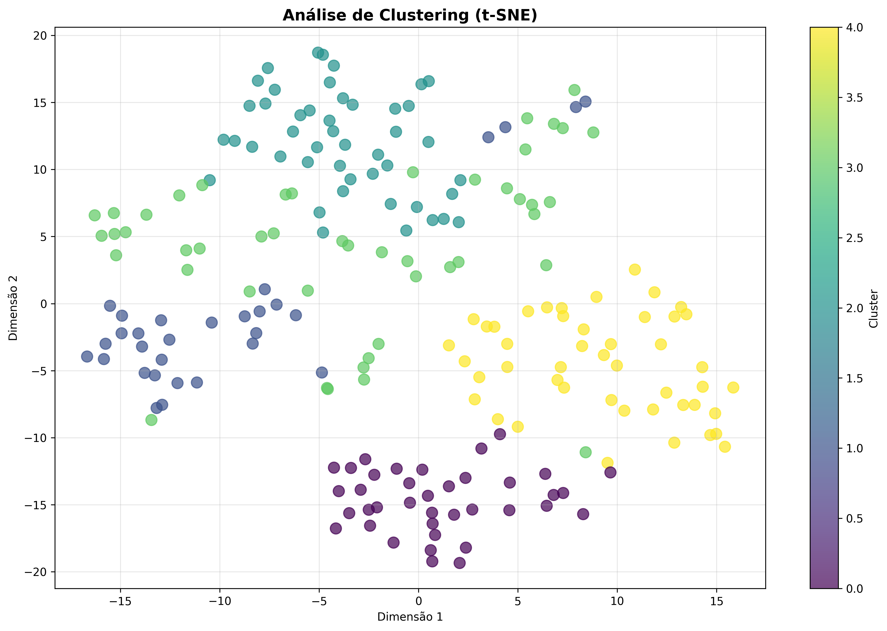
---

## Entidades Nomeadas (NER)

### Estatísticas por Tipo de Entidade
- **LOC:** 535 ocorrências
- **PER:** 481 ocorrências
- **MISC:** 226 ocorrências
- **ORG:** 124 ocorrências

### Top 25 Entidades Mais Mencionadas
| Tipo   | Entidade              |   Contagem |
|:-------|:----------------------|-----------:|
| LOC    | Cão-Tinhoso           |         97 |
| PER    | Maria                 |         58 |
| ORG    | Quim                  |         50 |
| PER    | Madala                |         50 |
| LOC    | Mamã                  |         47 |
| PER    | Vírgula Oito          |         41 |
| LOC    | Isaura                |         37 |
| PER    | Papá                  |         28 |
| LOC    | Quim                  |         22 |
| MISC   | Totó                  |         20 |
| PER    | Nandito               |         15 |
| PER    | Gulamo                |         15 |
| MISC   | Djimo                 |         14 |
| LOC    | Sartina               |         14 |
| PER    | Ginho                 |         13 |
| MISC   | Cão-Tinhoso           |         13 |
| LOC    | Faruk                 |         13 |
| LOC    | Papá                  |         13 |
| PER    | Senhor Duarte         |         12 |
| PER    | Sr. Castro            |         12 |
| PER    | Rodrigues             |         12 |
| LOC    | Senhora Professora    |         12 |
| LOC    | Vocês                 |         12 |
| PER    | Doutor Da Veterinária |         12 |
| LOC    | Madunana              |         11 |

---

## Estatísticas Gerais

- **Total de tokens processados:** 10,349
- **Vocabulário único:** 2,831
- **Densidade lexical:** 0.274

---

**Relatório gerado automaticamente com técnicas avançadas de Processamento de Linguagem Natural (NLP), Machine Learning (ML) e Método Reinert (CHD).**

**Tecnologias Utilizadas:** Método Reinert (1983, 1991), Modelos de Linguagem (LLM), Processamento e Análise Documental, Interfaces de Programação de IA, Processamento de Linguagem Natural (PLN), Aprendizado de Máquina e Mineração de Dados, Geração de Visualizações e Gráficos, Análise Estatística Avançada, Ferramentas de Produtividade, Análise Textual Aprofundada, Computação Paralela e Distribuída, e Estruturação de Relatórios Técnicos.

---

## Consultoria

David C Cavalcante

AI ML Engineer | Researcher Scientist | LLM Philosopher

- Email: [davcavalcante@proton.me](mailto:davcavalcante@proton.me)
- LinkedIn: [David C Cavalcante](https://linkedin.com/in/hellodav)
