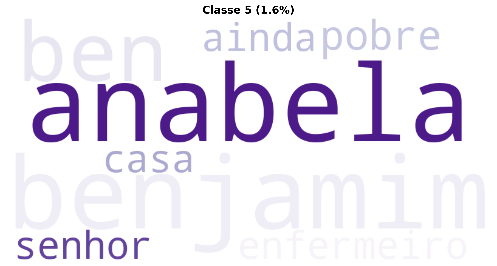

# Relatório de Análise Textual Avançada: MCouto_CadaHomemEUmaRacaOCR

Este relatório apresenta uma análise linguística e estatística abrangente da obra, utilizando técnicas avançadas de Processamento de Linguagem Natural, Machine Learning e o **Método Reinert** de Classificação Hierárquica Descendente (CHD), seguindo os padrões do software IRaMuTeQ.

---

## Método Reinert - Classificação Hierárquica Descendente (CHD)

O Método Reinert (1983, 1991) é uma técnica estatística de análise lexicométrica que identifica automaticamente classes lexicais homogêneas no corpus textual, revelando os "mundos lexicais" ou universos de sentido presentes no texto através de Classificação Hierárquica Descendente maximizando a estatística χ².

### Resultados da Classificação Hierárquica Descendente

| Classe | Percentual | Palavras |
|--------|------------|----------|
| Classe 8 (vermelho) | 88.5% | anabela, nunca, benjamim, à, homem, assim, sempre, mulher, lá, tio, geguê, padre, porta, senhor, espera |
| Classe 6 (verde) | 2.6% | tio, assim, geguê, menina, sapatos, tempo, vai, sombra, porque |
| Classe 4 (azul) | 2.0% | sempre, homem, amor, entrar, história, chuva, bicho, pessoa, via, coração, sou, dois |
| Classe 3 (amarelo) | 1.9% | nunca, mulher, viu, mazembe, daquela, causa, peixe, salima, tanto, quero, ben, mim, desses, nenhuma, homem |
| Classe 1 (rosa) | 1.8% | à, porta, espera, campa, junto, volta, frente, chegava, árvore, voltou, enquanto, nome, noite |
| Classe 5 (laranja) | 1.6% | anabela, benjamim, ben, pobre, enfermeiro, casa, ainda, senhor |
| Classe 7 (roxo) | 1.0% | lá, fora, vai, vão, mulato, está, barco, sair, mundo, aqui |
| Classe 2 (marrom) | 0.7% | padre, senhor, fui, viu, sei |

### Dendrograma da CHD

O dendrograma abaixo mostra a estrutura hierárquica da classificação, ilustrando como os segmentos de texto foram agrupados:

#### Nuvem de Palavras - Classe 1

#### Nuvem de Palavras - Classe 2

#### Nuvem de Palavras - Classe 3

#### Nuvem de Palavras - Classe 4

#### Nuvem de Palavras - Classe 5

#### Nuvem de Palavras - Classe 6

#### Nuvem de Palavras - Classe 7

#### Nuvem de Palavras - Classe 8

### Análise de Similitude

A análise de similitude mostra as relações de coocorrência entre as palavras mais frequentes:

---

## Nuvem de Palavras Geral

A nuvem de palavras oferece uma visualização das palavras mais frequentes após lematização e remoção de stopwords:

---

## Interpretação Especializada (LLM)

Como especialista em análise literária e linguística computacional, apresento a seguinte análise do texto fornecido:

---

### Análise Literária e Linguística Computacional do Texto

O texto apresenta duas seções distintas, mas tematicamente conectadas, explorando a individualidade, a identidade e a percepção social.

---

#### 1. Temas Centrais e Motivos Recorrentes

*   **Individualidade vs. Categorização Social:** O tema mais proeminente. João Passarinheiro rejeita categorizações externas de "raça", afirmando que "Minha raça sou eu mesmo. A pessoa é uma humanidade individual. Cada homem é uma raça". Esta ideia de identidade intrínseca é contrastada, de forma mais complexa, com a figura de Rosa Caramela, cuja "corcunda era a mistura das raças todas, seu corpo cruzava os muitos continentes," mas que é, paradoxalmente, excluída e singularizada pela sociedade.
*   **Rejeição e Exclusão Social:** Rosa Caramela é alvo de abandono familiar, de apelidos pejorativos ("corcunda-marreca", "Caramela") e de uma exclusão que a relega a um "recanto" e a uma existência marginal. A comunidade a observa, mas não a aceita plenamente, especialmente sua forma de comunicação com as estátuas.
*   **Deformidade e Beleza:** A figura de Rosa encarna a dicotomia entre a beleza fragmentada (sua "cara era linda") e a deformidade física (corcunda-marreca) que anula essa beleza aos olhos dos outros. A deformidade física torna-se um símbolo da sua "deformidade" social e existencial.
*   **Sonho Quebrado e Realidade Crua:** O motivo central da tragédia de Rosa é a sua espera frustrada pelo noivo, que destrói seu "sonho" e a lança em uma realidade de isolamento e estranheza. Este evento é o catalisador da sua condição.
*   **Comunicação e Incompreensão:** João Passarinheiro comunica sua filosofia de forma assertiva e clara. Rosa Caramela, por outro lado, comunica-se com estátuas, um ato incompreendido e temido pela comunidade ("chegava mesmo de assustar"), sublinhando a barreira entre sua realidade interna e a externa.
*   **Vulnerabilidade e Sobrevivência:** A extrema pobreza de Rosa, sua subsistência quase invisível ("Comia? Ninguém nunca lhe viu um sustento"), e sua fragilidade são constantemente enfatizadas, contrastando com sua resiliência em interagir com o mundo à sua maneira.

---

#### 2. Estilo Narrativo e Características Linguísticas

*   **Narrador e Ponto de Vista:**
    *   **João Passarinheiro:** Voz direta, em primeira pessoa, de caráter quase aforismático e filosófico. A presença do "senhor polícia" sugere um contexto de inquirição e confronto com a autoridade ou a norma.
    *   **Rosa Caramela:** Narrador em terceira pessoa, mas que frequentemente adota um "Nós" coletivo ("Nós lhe víamos", "lhe chamávamos"), o que denota uma perspectiva comunitária, por vezes empática, mas também julgadora e distanciada. Este "Nós" é crucial para entender a dinâmica de exclusão social.
*   **Linguagem Poética e Metafórica:** O texto é ricamente figurativo.
    *   "Acendemos paixões no rastilho do próprio coração." (Metáfora de auto-sofrimento)
    *   "O que amamos é sempre chuva, entre o voo da nuvem e a prisão do charco." (Metáfora da dualidade do amor: liberdade vs. aprisionamento)
    *   "somos caçadores que a si mesmo se azagaiam." (Metáfora de autodestruição)
    *   "olhos lhe eram escassos, dessa magreza de quererem, um dia, ser olhados, com esse redondo cansaço de terem sonhado." (Personificação e sinestesia, expressando profundo anseio)
    *   "A lua parecia pegar-se à marreca, como moeda em encosto avaro." (Comparação complexa, sugerindo uma ligação fria e opressora).
*   **Vocabulário e Neologismos/Termos Incomuns:**
    *   Uso de palavras pouco comuns ou com sentido expandido: "rastilho," "azagaiam," "petrimóveis" (para estátuas), "enquantos" (substantivação de "enquanto", sugerindo breves lapsos de tempo ou iluminação), "sobressonhava" (sonhar intensamente, além do normal). Tais usos contribuem para a atmosfera lírica e singular da escrita.
*   **Sintaxe Elaborada e Não Convencional:**
    *   **Inversões e Anacolutos:** "Dela se sabia quase pouco", "Lhe chamávamos Rosa Caramela", "A família se retirara, mal que lhe entregara na vida." A sintaxe por vezes se afasta da ordem direta, conferindo um tom mais literário e por vezes arcaizante ou popular.
    *   **Fragmentação:** O final do excerto de Rosa Caramela ("Toda...") é abrupto, deixando a frase suspensa e intensificando a sensação de perda e incompletude do "sonho".
*   **Oralidade:** Elementos como o "senhor polícia" e a introdução da história de Rosa ("Só um motivo se contava") sugerem uma tradição oral de contação de histórias ou um estilo narrativo que se aproxima da fala coloquial.

---

#### 3. Contexto Cultural e Social Evidenciado

*   **Preconceito e Marginalização:** A narrativa expõe a crueldade social para com os diferentes, seja pela categorização racial (negada por João) ou pela deformidade física e comportamento "anormal" (no caso de Rosa). A comunidade se autodenomina "nós", mas marginaliza Rosa.
*   **Pobreza Extrema:** A descrição do casebre de Rosa ("feito de pedra espontânea, sem cálculo nem aprumo," "sem cama nem mesa") e sua falta de sustento revelam um cenário de privação material severa, que agrava sua condição de abandono.
*   **Moralidade e Julgamento Social:** A "doença" de falar com estátuas é vista como inaceitável pela comunidade, ilustrando como comportamentos que fogem à norma são rapidamente patologizados e rejeitados, mesmo que, para Rosa, representem uma forma de interação e afeto.
*   **Resistência Individual:** A postura de João Passarinheiro é um ato de resistência contra a classificação imposta, afirmando a soberania do indivíduo sobre definições externas.

---

#### 4. Elementos Culturais ou Históricos Evidentes

*   **Questão da Raça:** A discussão sobre "raça" e identidade individual, embora atemporal, remete a debates sociais e políticos sobre categorização e etnicidade, frequentemente associados a contextos de diversidade cultural e, por vezes, de conflito ou discriminação. A figura do "polícia" intensifica essa conotação de controle ou interrogação oficial.
*   **Arquétipo da Noiva Abandonada:** O motivo do noivo que nunca veio é um arquétipo literário e folclórico recorrente, associado à tragédia feminina, à loucura por amor e à reclusão. Este evento serve como a explicação culturalmente aceita (ou "motivo") para a condição de Rosa.
*   **Espaços Públicos e Privados:** Os jardins como locais de "vaguear" e interação não convencional de Rosa contrastam com seu "recanto" invisível, refletindo a dinâmica entre a vida pública e a reclusão forçada.

---

#### 5. Particularidades da Escrita ou Estrutura Textual

*   **Estrutura Bipartida e Complementar:** O texto é composto por dois excertos aparentemente díspares, mas que dialogam. O primeiro (João Passarinheiro) funciona quase como uma tese filosófica sobre individualidade e identidade, que o segundo (Rosa Caramela) explora e complexifica através de uma narrativa trágica. Rosa, em sua singularidade e em ser a "mistura das raças todas", é a materialização poética da "humanidade individual" de João.
*   **Uso da Elipse e da Sugestão:** Em vez de explicações diretas, o texto opta por sugerir, como no final abrupto com "Toda...", que convida o leitor a completar o sentido da desilusão de Rosa.
*   **Reiteração e Variação:** A ideia de "raça" é repetida e reinterpretada em ambos os segmentos, demonstrando a obsessão do autor com a temática.
*   **Coerência Temática e Estilística:** Apesar da distinção de personagens e do foco narrativo, há uma unidade subjacente no tom melancólico, na riqueza da linguagem figurada e na exploração da condição humana em face da exclusão.
*   **Potencial para Análise Computacional:** A riqueza léxica, a densidade metafórica, a variação sintática, a ocorrência de neologismos e a distribuição de pronomes (e.g., "eu", "nós", "lhe") são características altamente quantificáveis e analisáveis por métodos computacionais para traçar padrões de autoria, complexidade estilística, ou mesmo detecção de traços de oralidade e subjetividade. A ambiguidade do "Nós" na segunda parte seria um ponto interessante para análise de sentimento ou de perspectiva narrativa.

---

---

## Análise de Sentimentos

- **Polaridade:** 0.067 (Neutro)
- **Subjetividade:** 0.775 (Subjetivo)

A polaridade varia de -1 (muito negativo) a +1 (muito positivo). A subjetividade varia de 0 (objetivo) a 1 (subjetivo).
---

## Modelagem de Tópicos LDA (Complementar)

Além das classes Reinert, a modelagem LDA identifica tópicos latentes baseados em coocorrências:

Erro na modelagem de tópicos: cannot compute LDA over an empty collection (no terms)

---

## Análise de Clustering

**Cluster 1:** passarinheiro, ninguém, menino, velho, mundo, tiago, vendedor, raça, casa, pássaro
**Cluster 2:** pai, chiquinha, filho, joão, mulato, constante, rosa, parecer, menino, bene
**Cluster 3:** tio, geguê, mulher, vida, rosalinda, jacinto, bota, dever, olho, corpo
**Cluster 4:** anabela, benjamim, enfermeiro, ben, vizinho, marido, senhor, velho, adormecer, noite
**Cluster 5:** senhora, patrão, padre, senhor, princesa, começar, mina, chegar, parecer, casa

---

## Entidades Nomeadas (NER)

### Estatísticas por Tipo de Entidade
- **PER:** 435 ocorrências
- **LOC:** 192 ocorrências
- **MISC:** 74 ocorrências
- **ORG:** 21 ocorrências

### Top 25 Entidades Mais Mencionadas
| Tipo   | Entidade      |   Contagem |
|:-------|:--------------|-----------:|
| PER    | Anabela       |         22 |
| PER    | Chiquinha     |         22 |
| LOC    | Rosalinda     |         20 |
| PER    | Geguê         |         20 |
| PER    | Rosa          |         19 |
| MISC   | Benjamim      |         17 |
| PER    | Sim           |         16 |
| PER    | Jacinto       |         14 |
| PER    | João          |         13 |
| PER    | Salima        |         13 |
| LOC    | Geguê         |         13 |
| LOC    | Anabela       |         12 |
| PER    | Bene          |         12 |
| PER    | Tiago         |         12 |
| PER    | Zabelani      |         11 |
| PER    | Ben           |         10 |
| PER    | Deus          |          9 |
| LOC    | Mazembe       |          8 |
| PER    | Tio           |          7 |
| PER    | Juca          |          7 |
| PER    | Rosa Caramela |          7 |
| LOC    | Firipe        |          6 |
| PER    | Vivito        |          6 |
| PER    | Fortin        |          6 |
| LOC    | Salima        |          5 |

---

## Estatísticas Gerais

- **Total de tokens processados:** 11,122
- **Vocabulário único:** 3,793
- **Densidade lexical:** 0.341

---

**Relatório gerado automaticamente com técnicas avançadas de Processamento de Linguagem Natural (NLP), Machine Learning (ML) e Método Reinert (CHD).**

**Tecnologias Utilizadas:** Método Reinert (1983, 1991), Modelos de Linguagem (LLM), Processamento e Análise Documental, Interfaces de Programação de IA, Processamento de Linguagem Natural (PLN), Aprendizado de Máquina e Mineração de Dados, Geração de Visualizações e Gráficos, Análise Estatística Avançada, Ferramentas de Produtividade, Análise Textual Aprofundada, Computação Paralela e Distribuída, e Estruturação de Relatórios Técnicos.

---

## Consultoria

David C Cavalcante

AI ML Engineer | Researcher Scientist | LLM Philosopher

- Email: [davcavalcante@proton.me](mailto:davcavalcante@proton.me)
- LinkedIn: [David C Cavalcante](https://linkedin.com/in/hellodav)
