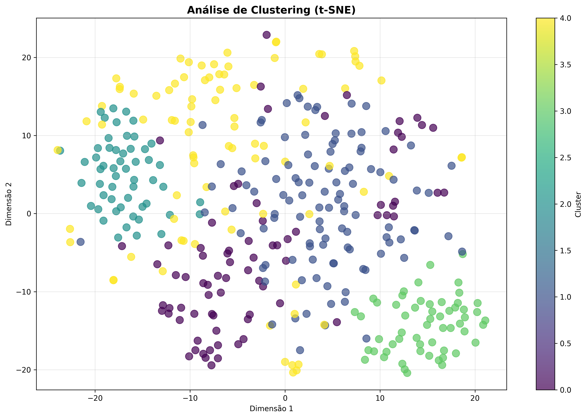

# Relatório de Análise Textual Avançada: OMendes_PortagemOCR

Este relatório apresenta uma análise linguística e estatística abrangente da obra, utilizando técnicas avançadas de Processamento de Linguagem Natural, Machine Learning e o **Método Reinert** de Classificação Hierárquica Descendente (CHD), seguindo os padrões do software IRaMuTeQ.

---

## Método Reinert - Classificação Hierárquica Descendente (CHD)

O Método Reinert (1983, 1991) é uma técnica estatística de análise lexicométrica que identifica automaticamente classes lexicais homogêneas no corpus textual, revelando os "mundos lexicais" ou universos de sentido presentes no texto através de Classificação Hierárquica Descendente maximizando a estatística χ².

### Resultados da Classificação Hierárquica Descendente

| Classe | Percentual | Palavras |
|--------|------------|----------|
| Classe 4 (vermelho) | 83.8% | joão, xilim, campos, helena, patrão, maria, vez, à, caju, casa, gente, filha, outra, mulher, primeira |
| Classe 1 (verde) | 5.5% | joão, xilim, amigo, pensa, passa, mineiros, sai, mulher, vai |
| Classe 8 (azul) | 3.4% | à, mulher, filha, chega, espera, cabana, passado, chegar, fortaleza, sobre, fez, primeira, vida |
| Classe 2 (amarelo) | 1.9% | campos, patrão, kati, moleque, casa, mina, filha, laura, negra, d, menino, marandal, carvão, dono, será |
| Classe 6 (rosa) | 1.5% | gente, muita, sabe, branca, anda, negra, outra, está, ia, cima, quê, aqui, coisas, nada, tinha |
| Classe 3 (laranja) | 1.4% | helena, maria, laura, menina, capataz, moleque, medo, kati, infância, alima, d, durante, apenas, vezes |
| Classe 7 (roxo) | 1.3% | caju, casa, entrar, chegar, caminho, cabeça, à, chega, disso, dono, negras, coragem, deixar, apenas, marcelino |
| Classe 5 (marrom) | 1.2% | vez, outra, primeira, cada, ti, sentenciado, fortaleza, vão, duas, vê, horas |

### Dendrograma da CHD

O dendrograma abaixo mostra a estrutura hierárquica da classificação, ilustrando como os segmentos de texto foram agrupados:

#### Nuvem de Palavras - Classe 1

#### Nuvem de Palavras - Classe 2

#### Nuvem de Palavras - Classe 3

#### Nuvem de Palavras - Classe 4

#### Nuvem de Palavras - Classe 5

#### Nuvem de Palavras - Classe 6

#### Nuvem de Palavras - Classe 7

#### Nuvem de Palavras - Classe 8

### Análise de Similitude

A análise de similitude mostra as relações de coocorrência entre as palavras mais frequentes:

---

## Nuvem de Palavras Geral

A nuvem de palavras oferece uma visualização das palavras mais frequentes após lematização e remoção de stopwords:

---

## Interpretação Especializada (LLM)

A análise do excerto "PARA MINHA MULHER" revela uma rica tapeçaria de elementos literários, históricos e sociais, cuja complexidade pode ser desvendada tanto por uma leitura atenta quanto por abordagens de linguística computacional.

---

### Análise Textual Detalhada

#### 1. Temas Centrais e Motivos Recorrentes

*   **Declínio e Envelhecimento:** A personagem Alima personifica a decadência física e sensorial ("olhos doridos", "boca encarquilha-se", "mãos secas", "corpo magro", "pálpebras purulentas", "vista se limita"). Este declínio individual reflete-se e é amplificado pela paisagem circundante ("árvore mirrada", "capim ressequido", "planície mordida pelo sol", "diminui de extensão").
*   **Solidão e Abandono:** A "solidão enorme da velha Alima" é um tema central, acentuado pelo abandono da povoação original e pela distância da filha. A paisagem desolada e a ausência de pessoas ou feras reforçam este isolamento.
*   **Memória e História Oral:** Alima é a "única pessoa viva que ouviu da boca dos escravos a história recontada do mundo da planície", tornando-a guardiã de uma memória coletiva e histórica. A narrativa intercala a experiência presente de Alima com flashes de memória pessoal e coletiva (escravidão, seca, migração, mineração).
*   **Exploração e Colonialismo:** A chegada dos "brancos com as suas máquinas para abrirem os grandes buracos na terra e tirar o carvão que os negros carregam para as vagonetas" evidencia a exploração de recursos naturais e da mão-de-obra negra, um traço marcante do colonialismo.
*   **Resistência e Apego à Terra:** A recusa de Alima em abandonar a planície, mesmo desabitada e empobrecida, simboliza uma forma de resistência cultural e um profundo apego à ancestralidade e à identidade ligada à terra.
*   **Temporalidade e Cyclidade:** A repetição de expressões como "Dia a dia", "Todos os dias", e "De ano para ano" sugere uma rotina monótona e a inexorabilidade do tempo, que traz consigo tanto o esquecimento quanto a erosão da memória e do mundo.

**Motivos Recorrentes:**
*   **Os Olhos/A Vista:** São a interface entre Alima e o mundo, mas também o ponto de declínio ("olhos doridos", "vista se limita", "olhos de pálpebras purulentas", "olhos mortiços"). Representam a percepção e o progressivo isolamento sensorial.
*   **A Planície:** Espaço geográfico central, é também um reflexo do estado de Alima: outrora vasta, agora "encurtada", "mirrada", "quase despida", "moribunda".
*   **O Cajueiro:** Plantado pelo avô escravo Mafanissane, é um elo vital com o passado, a ancestralidade e a libertação. Sua presença "entre a erva rasteira e os galhos agrestes das micaias" sublinha a solidão e a resiliência.
*   **O Sono/Despertar:** A luta contra o "sono inimigo" e o medo de "perder de vez a contemplação da planície" simbolizam a batalha de Alima contra o esquecimento e a morte.

#### 2. Estilo Narrativo e Características Linguísticas

*   **Narrador Onisciente e Focalização Interna:** O texto emprega um narrador heterodiegético (terceira pessoa) que tem acesso total aos pensamentos e sentimentos de Alima, bem como à sua história ("Alima geme de cansaço. Ou de tédio? Nem ela saberia dizer.").
*   **Linguagem Descritiva Detalhada:** Há uma profusão de adjetivos e advérbios que pintam um quadro vívido da velhice, da paisagem e do estado emocional de Alima ("luz crua", "olhos doridos", "boca encarquilha-se", "ranger medroso", "vento quente e vagaroso", "capim ressequido", "corpo magro", "pálpebras purulentas", "solidão enorme").
*   **Ritmo Lento e Melancólico:** A sintaxe tende a ser fluida, com algumas frases longas que constroem uma atmosfera de contemplação, cansaço e melancolia, refletindo o estado da personagem.
*   **Figuras de Linguagem:**
    *   **Personificação:** "luz crua do sol", "ranger medroso dos ramos nus", "vento quente e vagaroso que passa e se esconde na terra", "planície mordida pelo sol", "sono inimigo".
    *   **Metáfora:** "mar de ondas bravias que foi a fronteira da emigração".
    *   **Comparação Implícita:** A planície que diminui à medida que a vista de Alima se limita.
*   **Vocabulário Específico do Contexto:** Termos como "palhota", "capulana", "bordão nodoso", "cajueiro", "micaias", "capataz", "vagonetas" contextualizam a narrativa em um ambiente rural africano submetido à exploração mineira.
*   **Ambiguidade:** A pergunta retórica "Alima geme de cansaço. Ou de tédio?" introduz uma nuance psicológica que aprofunda a personagem, sugerindo uma introspecção tanto da personagem quanto do narrador.
*   **Metaficção:** A epígrafe inicial ("PARA MINHA MULHER... O autor pretendeu que esta narrativa fosse verosímil. Mas, tenha eu não conseguido o seu intento, esclarece que pessoas, designações, factos e lugares de que trata, são imaginários.") é um elemento metaficcional clássico. Ela estabelece um pacto de leitura, questiona a própria "verdade" da ficção e separa a voz autoral da narrativa.

#### 3. Contexto Cultural e Social Evidenciado

*   **Sociedade Rural e Tradicional:** A vida em "palhotas", a dependência da terra, a menção de "capulana" e "bordão" apontam para uma comunidade com costumes e estrutura social tradicionais, em contraste com a modernidade imposta pela mineração.
*   **Estrutura Social Racializada:** A distinção clara entre "negra Alima" e "os brancos" (que vêm com as máquinas) e a menção de "escravo Mafanissane" e "filho de branco" destacam uma hierarquia racial presente, possivelmente no contexto colonial ou pós-colonial.
*   **Exploração do Trabalho e dos Recursos:** A descrição da mineração de carvão e do trabalho dos "negros que carregam para as vagonetas" ilustra um modelo econômico extrativista e a exploração da mão-de-obra local.
*   **Impacto das Catástrofes Naturais e Migrações:** A "grande seca" e a "emigração dos negros para o sul" são elementos que conectam a narrativa a fenômenos sociais e ambientais recorrentes em regiões africanas, moldando a história e as comunidades.
*   **Transmissão de Conhecimento:** O papel de Alima como guardiã da história oral dos escravos enfatiza a importância das tradições orais em culturas onde a escrita pode não ter sido o principal meio de registro histórico.

#### 4. Elementos Culturais ou Históricos Evidentes

*   **Escravatura e Abolição:** A figura do avô "Mafanissane, o escravo [...] no dia da sua libertação" é uma referência direta à história da escravidão e do abolicionismo, um marco histórico fundamental.
*   **Colonialismo e Mineração:** A presença dos "brancos com as suas máquinas" e a exploração de carvão na "serra do Marandal" remetem à fase da exploração colonial de recursos naturais em África, com a consequente formação de núcleos urbanos e industriais (o Marandal como nova povoação).
*   **Capulana:** Peça de vestuário africana, geralmente um tecido estampado e colorido usado pelas mulheres, que culturaliza a personagem.
*   **Cajueiro e Micaias:** Árvores típicas de certas regiões tropicais, conferem autenticidade geográfica e simbólica à paisagem.
*   **Grandes Secas:** Referência a períodos históricos de escassez hídrica que provocaram deslocamentos populacionais, uma realidade socioambiental em várias partes do continente africano.

#### 5. Particularidades da Escrita ou Estrutura Textual

*   **Abertura Metaficcional:** A epígrafe serve como um prefácio autoral que descola o texto da pretensão de "verdade" factual, convidando a uma leitura que valoriza a dimensão simbólica e imaginativa, apesar da busca por verossimilhança. Isso pode ser interpretado como uma estratégia para sublinhar a universalidade da experiência narrada, transcendendo os detalhes específicos de pessoas e lugares.
*   **Estrutura de Parágrafo Único (Capítulo 1):** O primeiro capítulo é apresentado como um bloco coeso e denso de texto, o que pode mimetizar o fluxo contínuo da consciência e da memória de Alima. Esta estrutura contribui para a imersão na sua perspectiva e no seu mundo "encurtado", sem interrupções visuais que pudessem quebrar o ritmo lento e a sensação de tempo suspenso.
*   **Elipse Final:** O texto termina abruptamente com uma elipse ("se faz pe..."), sugerindo uma interrupção, um corte, ou a continuação implícita de uma realidade que não precisa ser explicitada. Cria uma expectativa no leitor e realça a incompletude ou a inevitabilidade de um destino.
*   **Alternância Temporal:** A narrativa alterna fluidamente entre o presente de Alima ("sai da palhota", "geme de cansaço") e o passado ("chão pisado por três gerações", "plantado por seu avô", "emigração dos negros", "Kati casou"). Esta técnica constrói a profundidade histórica e a carga de memória que a personagem carrega.
*   **Repetição Estrutural:** A repetição de frases e conceitos ("De ano para ano, a planície diminui de extensão", "Solidão enorme da velha Alima. Solidão a coincidir com...") funciona como um refrão que enfatiza o caráter cíclico do declínio e o peso dos temas abordados.

---

Em suma, o excerto é uma poderosa representação da memória, da história e da resiliência de um indivíduo frente à exploração e ao declínio. A análise linguística computacional poderia aprofundar a identificação de padrões lexicais e sintáticos, a análise de sentimentos (predominantemente melancólicos e de desesperança), a extração de entidades nomeadas para mapeamento histórico-geográfico, e a detecção de figuras de linguagem, confirmando as interpretações literárias aqui apresentadas e revelando a densidade temática e estilística do texto.

---

## Análise de Sentimentos

- **Polaridade:** 0.071 (Neutro)
- **Subjetividade:** 0.474 (Objetivo)

A polaridade varia de -1 (muito negativo) a +1 (muito positivo). A subjetividade varia de 0 (objetivo) a 1 (subjetivo).
---

## Modelagem de Tópicos LDA (Complementar)

Além das classes Reinert, a modelagem LDA identifica tópicos latentes baseados em coocorrências:

Erro na modelagem de tópicos: cannot compute LDA over an empty collection (no terms)

---

## Análise de Clustering

**Cluster 1:** casa, mulher, cantina, senhora, caju, justino, cidade, marido, negócio, rodrigues
**Cluster 2:** joão, xilim, gente, branco, homem, mulato, mulher, falar, negro, luísa
**Cluster 3:** campos, patrão, moleque, maria, heleno, mina, marandal, xilim, joão, negro
**Cluster 4:** gamboa, coxo, juza, beatriz, luísa, canoa, peixe, banca, joão, bazar
**Cluster 5:** terra, vida, marandal, filha, dia, planície, mundo, hora, ano, pai

---

## Entidades Nomeadas (NER)

### Estatísticas por Tipo de Entidade
- **PER:** 943 ocorrências
- **LOC:** 569 ocorrências
- **MISC:** 106 ocorrências
- **ORG:** 34 ocorrências

### Top 25 Entidades Mais Mencionadas
| Tipo   | Entidade        |   Contagem |
|:-------|:----------------|-----------:|
| PER    | João Xilim      |        200 |
| LOC    | Marandal        |         61 |
| LOC    | Luísa           |         61 |
| LOC    | Coxo            |         59 |
| PER    | João            |         53 |
| PER    | Luísa           |         46 |
| PER    | Beatriz         |         44 |
| PER    | Maria Helena    |         42 |
| PER    | Juza            |         42 |
| LOC    | Casa Do Caju    |         40 |
| PER    | Justino         |         32 |
| PER    | Isidro          |         24 |
| PER    | Sr. Esteves     |         23 |
| LOC    | Campos          |         22 |
| LOC    | Alima           |         20 |
| PER    | Rafael          |         20 |
| LOC    | Maria Helena    |         19 |
| PER    | Jaime           |         19 |
| PER    | Kati            |         17 |
| LOC    | Olha            |         16 |
| LOC    | Ridjalembe      |         16 |
| LOC    | Patrão Campos   |         16 |
| LOC    | Kati            |         16 |
| PER    | Patrão Campos   |         15 |
| PER    | Mamane Angelina |         15 |

---

## Estatísticas Gerais

- **Total de tokens processados:** 19,097
- **Vocabulário único:** 4,387
- **Densidade lexical:** 0.230

---

**Relatório gerado automaticamente com técnicas avançadas de Processamento de Linguagem Natural (NLP), Machine Learning (ML) e Método Reinert (CHD).**

**Tecnologias Utilizadas:** Método Reinert (1983, 1991), Modelos de Linguagem (LLM), Processamento e Análise Documental, Interfaces de Programação de IA, Processamento de Linguagem Natural (PLN), Aprendizado de Máquina e Mineração de Dados, Geração de Visualizações e Gráficos, Análise Estatística Avançada, Ferramentas de Produtividade, Análise Textual Aprofundada, Computação Paralela e Distribuída, e Estruturação de Relatórios Técnicos.

---

## Consultoria

David C Cavalcante

AI ML Engineer | Researcher Scientist | LLM Philosopher

- Email: [davcavalcante@proton.me](mailto:davcavalcante@proton.me)
- LinkedIn: [David C Cavalcante](https://linkedin.com/in/hellodav)
