# Relatório de Análise Textual Avançada: corpus_completo

Este relatório apresenta uma análise linguística e estatística abrangente da obra, utilizando técnicas avançadas de Processamento de Linguagem Natural, Machine Learning e o **Método Reinert** de Classificação Hierárquica Descendente (CHD), seguindo os padrões do software IRaMuTeQ.

---

## Método Reinert - Classificação Hierárquica Descendente (CHD)

O Método Reinert (1983, 1991) é uma técnica estatística de análise lexicométrica que identifica automaticamente classes lexicais homogêneas no corpus textual, revelando os "mundos lexicais" ou universos de sentido presentes no texto através de Classificação Hierárquica Descendente maximizando a estatística χ².

### Resultados da Classificação Hierárquica Descendente

| Classe | Percentual | Palavras |
|--------|------------|----------|
| Classe 6 (vermelho) | 90.8% | joão, xilim, cão, tinhoso, vez, à, maria, patrão, campos, casa, helena, outra, mulher, cada, primeira |
| Classe 8 (verde) | 1.8% | casa, mulher, à, entrar, caminho, homem, desde, vida, fim, criança, quer, dinheiro, afinal, amor, sempre |
| Classe 1 (azul) | 1.7% | joão, xilim, amigo, luísa, gamboa, negro, olha, cidade, agora, marandal, dias, helena, conta, gente, mulher |
| Classe 3 (amarelo) | 1.7% | à, volta, gamboa, vamos, noite, filha, noites, boca, chegou, pés, cidade, rei, escuro, marido, todas |
| Classe 4 (rosa) | 1.4% | vez, outra, cada, primeira, dormir, faz, morte |
| Classe 2 (laranja) | 1.1% | cão, tinhoso, isaura, matar, quim, medo, fui, causa, devia, disse, queria, morrer, andar, tenho, força |
| Classe 7 (roxo) | 0.8% | patrão, campos, mina, casa, filha, marandal, grandes, têm, preto, respondeu, nunca, senhora, será, machamba |
| Classe 5 (marrom) | 0.7% | maria, helena, menina, olhos, costas, capataz, durante, apenas, marandal, dormir, pés, respondeu, medo, sente, mãe |

### Dendrograma da CHD

O dendrograma abaixo mostra a estrutura hierárquica da classificação, ilustrando como os segmentos de texto foram agrupados:

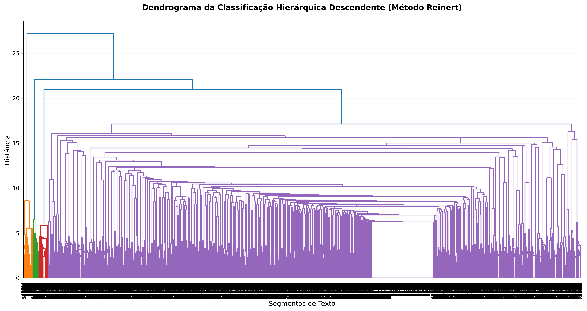

#### Nuvem de Palavras - Classe 1

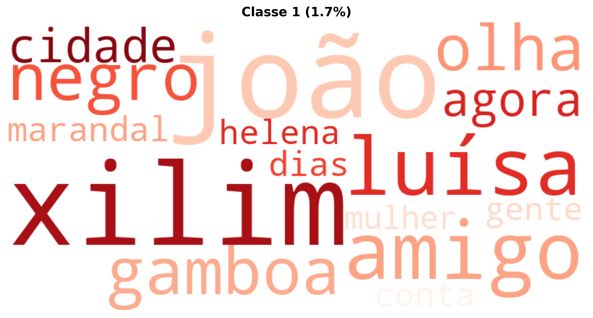

#### Nuvem de Palavras - Classe 2

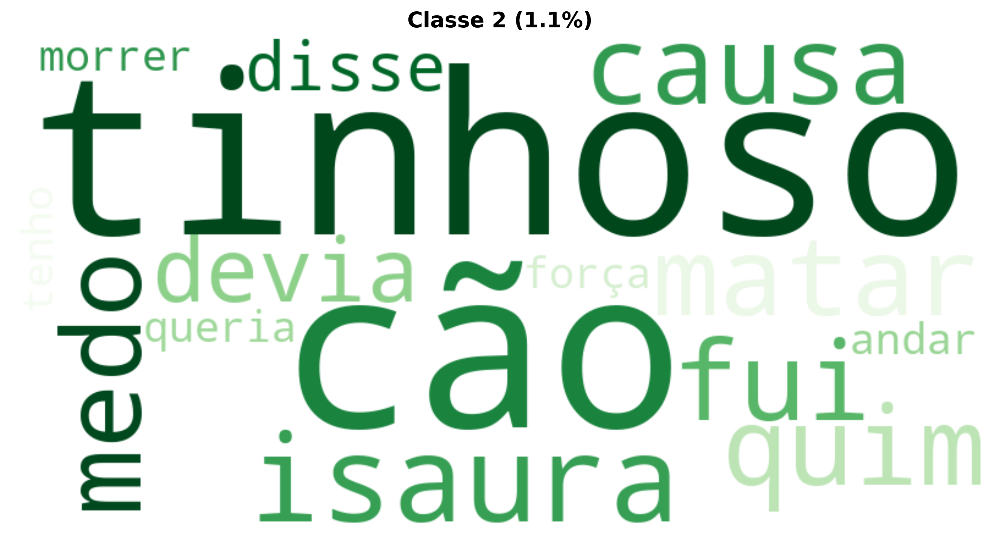

#### Nuvem de Palavras - Classe 3

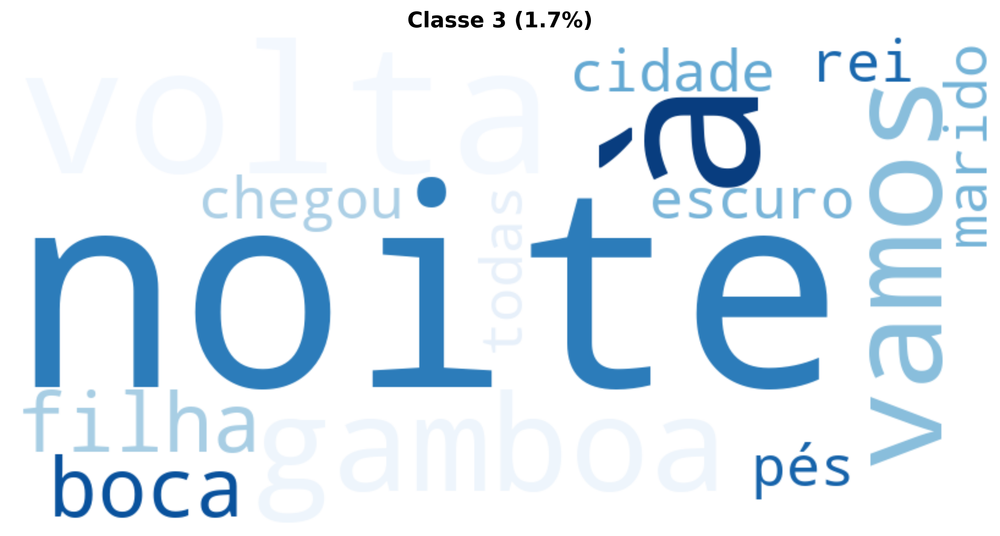

#### Nuvem de Palavras - Classe 4

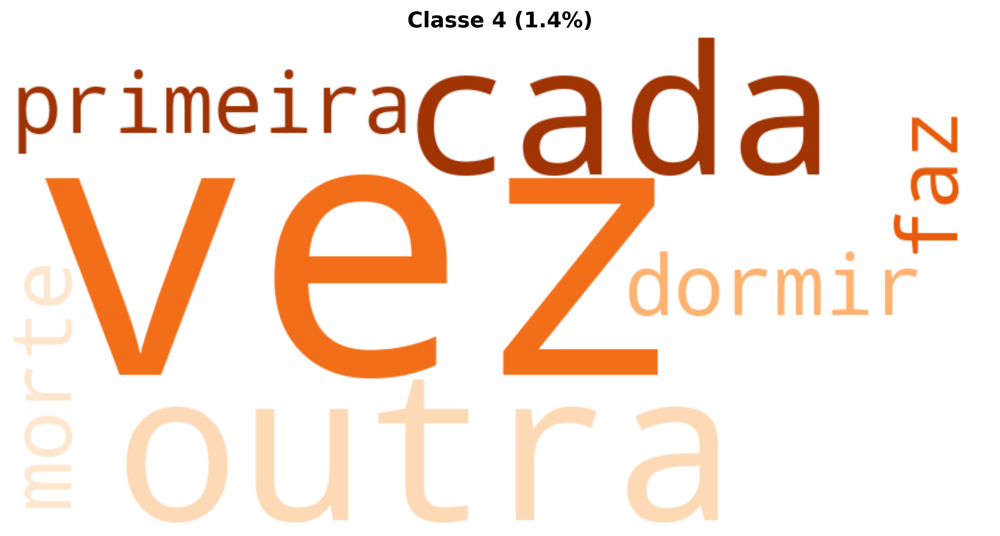

#### Nuvem de Palavras - Classe 5

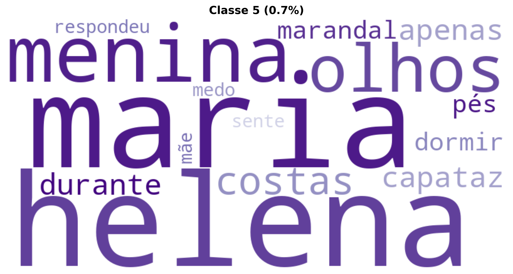

#### Nuvem de Palavras - Classe 6

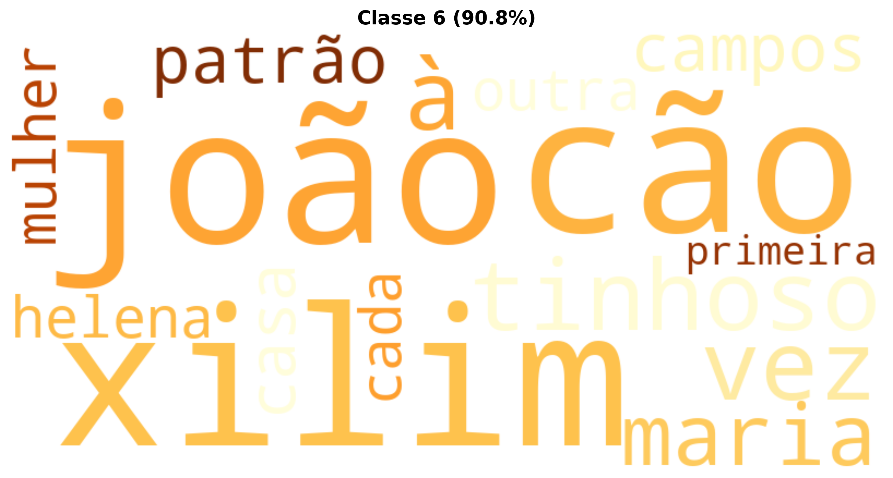

#### Nuvem de Palavras - Classe 7

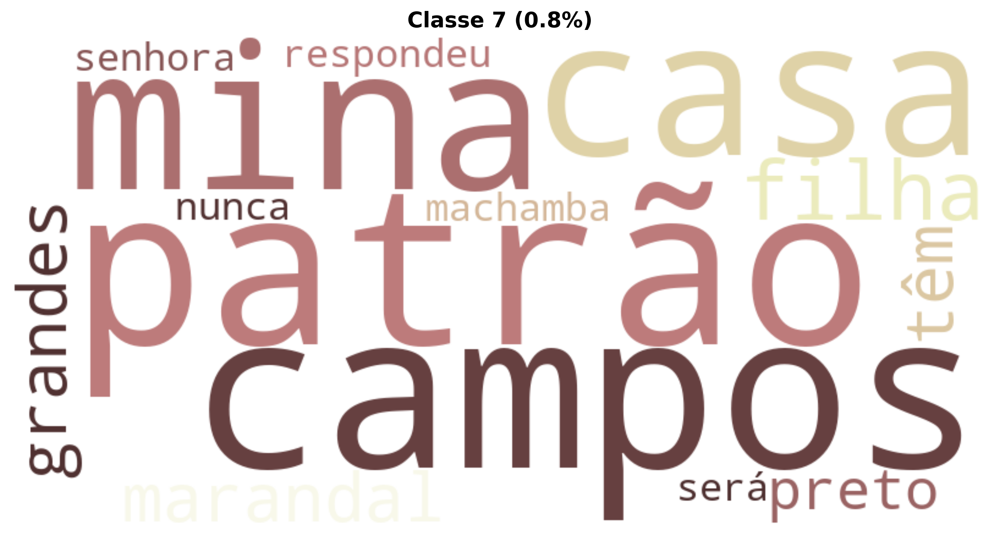

#### Nuvem de Palavras - Classe 8

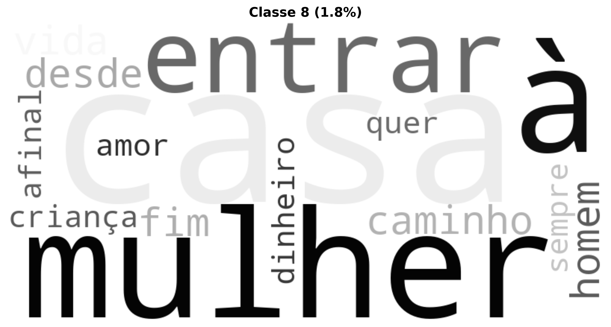

### Análise de Similitude

A análise de similitude mostra as relações de coocorrência entre as palavras mais frequentes:

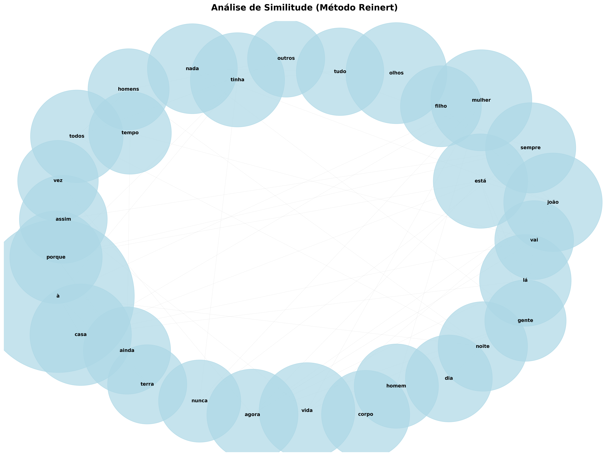

---

## Nuvem de Palavras Geral

A nuvem de palavras oferece uma visualização das palavras mais frequentes após lematização e remoção de stopwords:

---

## Interpretação Especializada (LLM)

A narrativa "A fogueira" apresenta um microcosmo de existência humana marcada pela velhice, pobreza e a inevitabilidade da morte, sob uma lente de aparente resignação e um estranho afeto. A análise subsequente detalha os pontos solicitados, com ênfase nos aspectos relevantes para a linguística computacional.

---

### Análise de "A fogueira"

#### 1. Temas Centrais e Motivos Recorrentes

Os **temas centrais** orbitam a **morte e a mortalidade**, abordadas de forma prática e crua, não como um evento distante, mas como uma contingência iminente e logística. A **pobreza extrema** é outro pilar, moldando as ações e preocupações dos personagens ("Só temos nadas. Nem ninguém não temos."). A **velhice e a decadência física e emocional** são constantemente sublinhadas ("pernas sofriam o cansaço," "Meu marido está a diminuir," "É uma sombra"). Paradoxalmente, um **amor e cuidado singulares** emergem da preocupação do velho em enterrar a esposa, e da aceitação e até gratidão dela ("Como és bom marido!"). A **solidão** é uma presença constante, exacerbada pela perda dos filhos e pela ausência de apoio externo ("mesmo o vento estava sozinho").

**Motivos recorrentes** incluem:
*   **A Cova/Sepultura:** O objeto central da ação e do diálogo, simbolizando a preparação para a morte e a inevitabilidade do fim.
*   **O Caminho/Estrada:** Usado metaforicamente para a jornada da vida ("caminhos idosos") e para a perda ("na estrada sem regresso").
*   **A Chuva:** Funciona como um elemento adverso da natureza, que impede e destrói o trabalho humano, realçando a fragilidade e o desamparo.
*   **O Silêncio:** Pontua momentos de reflexão e aceitação, sublinhando a gravidade das situações e a comunicação muitas vezes não verbal entre o casal. Para a análise computacional de diálogo, a detecção de pausas e silêncios pode indicar turnos de fala, hesitação ou processamento cognitivo.

#### 2. Estilo Narrativo e Características Linguísticas

O **estilo narrativo** é marcadamente **minimalista e direto**, com um narrador em terceira pessoa, onisciente, que se foca mais nas ações e diálogos do que em descrições extensas. O ritmo é lento e contemplativo, refletindo a idade e a condição dos personagens. A narrativa é construída principalmente através do **diálogo**, que é conciso e funcional, revelando a essência dos personagens e a progressão da trama.

As **características linguísticas** são notavelmente singulares e relevantes para a linguística computacional:
*   **Oralidade e Coloquialismo:** Há uma forte presença de características da fala cotidiana e regionalizada. Exemplos incluem:
    *   A omissão da preposição 'a' com verbos de ligação no gerúndio: "Meu marido está diminuir" (em vez de "a diminuir").
    *   A construção "como que eu" (em vez de "como eu").
    *   A dupla negação "Nem ninguém não temos".
    *   A concordância irregular "Você és muito velha".
    *   O uso de "barulha" (no imperativo) como "fazer barulho".
    *   Essas construções são marcadores dialetais importantes para sistemas de Processamento de Linguagem Natural (PLN) que lidam com variedades do português (ex: variação lusófona africana vs. europeia/brasileira), impactando tarefas como análise sintática, reconhecimento de entidades e sentimentos.
*   **Lexicografia Simples e Repetitiva:** O vocabulário é acessível, com repetição de termos-chave como "velho," "mulher," "marido," "cova," "chuva," "terra." A análise de frequência lexical revelaria esses termos como centrais ao enredo, útil para sumarização automática e extração de tópicos.
*   **Estruturas Frasais Simplificadas:** Predominam frases curtas e com estrutura sujeito-verbo-objeto, facilitando a análise sintática computacional e o parsing.
*   **Uso de Metáforas e Símiles Diretos:** "É uma sombra" para descrever a magreza do velho, "charco sem respeito" para a cova cheia de água, "rio da chuva" para a intensidade da precipitação. A identificação de figuras de linguagem em PLN ainda é um desafio, mas a clareza dessas figuras no texto as torna mais detectáveis.
*   **Deixis Pessoal e Temporal:** Referências como "aqui," "lá," "amanhã," "parte da noite" ancoram a narrativa no tempo e espaço imediatos dos personagens.

#### 3. Contexto Cultural e Social Evidenciado

O texto pinta um quadro vívido de **pobreza rural e subsistência** em um ambiente possivelmente isolado. A "esteira," "tigelas, cestas, pilão," "mato," e a "cantina" como um ponto distante de comércio, indicam uma vida desprovida de modernidades e recursos. A ausência de apoio externo ("Nem ninguém não temos") aponta para uma **estrutura social frágil ou isolada**, onde a sobrevivência é uma luta individual do casal. A "capulana," mencionada no gesto da mulher, é um fortíssimo **marcador cultural** que indica um contexto da **África Lusófona**, comumente Moçambique ou Angola, onde essa peça de vestuário é tradicional e amplamente utilizada. Este elemento é crucial para a categorização geográfica e cultural automática do texto. A aceitação da morte e a preocupação prática com o enterro, em vez de rituais ou tratamentos médicos (não mencionados), sugerem uma adaptação a condições de vida extremas e uma visão fatalista do destino.

#### 4. Elementos Culturais ou Históricos Evidentes

*   **A Capulana:** Como já mencionado, é o elemento cultural mais explícito e inconfundível. Para a linguística computacional, a detecção de termos culturalmente específicos como "capulana" é vital para a identificação do domínio geográfico e cultural do texto, enriquecendo a análise de entidades nomeadas e a classificação temática.
*   **Linguagem Regional/Dialetal:** As particularidades do português falado pelos personagens (ex: "você és", omissão do "a" antes do gerúndio) são reflexos de dialetos ou socioletos específicos da África Lusófona. A análise computacional desses desvios da norma culta é fundamental para o desenvolvimento de modelos de linguagem mais robustos e adaptados a diferentes variações linguísticas.
*   **Modo de Vida Primitivo/Tradicional:** A dependência da lenha, a ausência de infraestruturas (saúde, assistência social), e a importância da "cantina" como único ponto de troca comercial, denotam um contexto histórico ou social de subdesenvolvimento ou de comunidades remotas. A identificação desses termos e seus contextos pode auxiliar na construção de ontologias de cenários sociais.

#### 5. Particularidades da Escrita ou Estrutura Textual

*   **Fragmentação do Final:** O texto termina abruptamente com "o cinzent...", sem um ponto final ou resolução clara. Essa interrupção pode ser intencional, simbolizando a interrupção da vida ou a continuidade interminável da luta, ou pode ser um excerto de uma obra maior. Para a análise computacional, um final abrupto pode ser um desafio para algoritmos de sumarização automática que buscam uma conclusão, ou para análise de sentimento que tenta identificar o desfecho emocional da narrativa.
*   **Uso Enigmático do Título "A fogueira":** O título não é explicitamente abordado na narrativa até o ponto de interrupção. Pode ser uma metáfora para a vida se esvaindo ("queimar a vida"), para o calor humano em meio à desolação, para a creche (embora planejem o enterro), ou até para o fogo de chão, elemento central na vida rural. A desconexão inicial entre título e conteúdo convida à interpretação e é um ponto interessante para a análise semântica e contextual.
*   **Foco na Microrrealidade:** A narrativa se restringe à interação do casal e sua tarefa imediata, sem grandes eventos externos ou personagens secundários. Isso cria uma intensidade e profundidade na exploração dos temas da velhice e da morte, tornando o texto um excelente corpus para análise de interações entre dois agentes e seus estados mentais e emocionais.
*   **Pequenos Detalhes Carregados de Significado:** "levantou a pá para melhor a acusar" é um exemplo de como uma frase simples encapsula a relação, o esforço e o custo. A análise computacional pode tentar identificar essas "frases-chave" com alto teor semântico para sumarização extrativa ou para a identificação de pontos de virada na narrativa.

---

Em suma, "A fogueira" é um texto rico em nuances culturais e linguísticas, oferecendo um material valioso para a análise computacional, especialmente na área de PLN voltada para a detecção de dialetos, análise de oralidade, reconhecimento de entidades culturais específicas e a compreensão de narrativas minimalistas e emocionalmente carregadas.

---

## Análise de Sentimentos

- **Polaridade:** 0.089 (Neutro)
- **Subjetividade:** 0.662 (Subjetivo)

A polaridade varia de -1 (muito negativo) a +1 (muito positivo). A subjetividade varia de 0 (objetivo) a 1 (subjetivo).
---

## Modelagem de Tópicos LDA (Complementar)

Além das classes Reinert, a modelagem LDA identifica tópicos latentes baseados em coocorrências:

Erro na modelagem de tópicos: cannot compute LDA over an empty collection (no terms)

---

## Análise de Clustering

**Cluster 1:** mulher, homem, velho, vida, filho, casa, água, noite, criança, olhar
**Cluster 2:** joão, xilim, maria, negro, marandal, patrão, casa, campos, mulato, gente
**Cluster 3:** noite, terra, corpo, dia, olho, casa, mão, vida, chegar, olhar
**Cluster 4:** gamboa, coxo, juza, luísa, joão, xilim, marido, peixe, filho, branco
**Cluster 5:** quim, senhor, cão, olhar, andar, senhora, falar, medo, olho, administrador

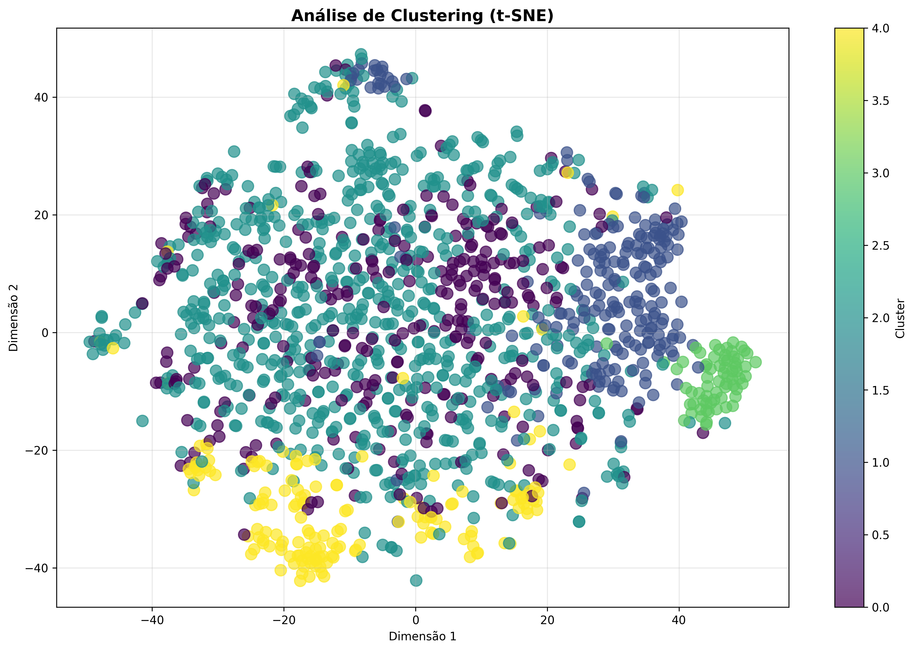
---

## Entidades Nomeadas (NER)

### Estatísticas por Tipo de Entidade
- **PER:** 3028 ocorrências
- **LOC:** 2246 ocorrências
- **MISC:** 728 ocorrências
- **ORG:** 272 ocorrências

### Top 25 Entidades Mais Mencionadas
| Tipo   | Entidade     |   Contagem |
|:-------|:-------------|-----------:|
| PER    | João Xilim   |        200 |
| PER    | João         |        112 |
| LOC    | Cão-Tinhoso  |         97 |
| PER    | Maria        |         75 |
| LOC    | Luísa        |         61 |
| LOC    | Marandal     |         61 |
| LOC    | Coxo         |         59 |
| PER    | Madala       |         50 |
| ORG    | Quim         |         50 |
| LOC    | Mamã         |         47 |
| PER    | Luísa        |         46 |
| PER    | Beatriz      |         45 |
| PER    | Deus         |         44 |
| PER    | Maria Helena |         42 |
| PER    | Juza         |         42 |
| PER    | Vírgula Oito |         41 |
| LOC    | Casa Do Caju |         40 |
| LOC    | Olha         |         38 |
| LOC    | Isaura       |         37 |
| PER    | Sim          |         34 |
| PER    | Justino      |         32 |
| LOC    | Vocês        |         31 |
| PER    | Papá         |         28 |
| PER    | Laurinda     |         28 |
| LOC    | Damboia      |         27 |

---

## Estatísticas Gerais

- **Total de tokens processados:** 73,830
- **Vocabulário único:** 11,742
- **Densidade lexical:** 0.159

---

**Relatório gerado automaticamente com técnicas avançadas de Processamento de Linguagem Natural (NLP), Machine Learning (ML) e Método Reinert (CHD).**

**Tecnologias Utilizadas:** Método Reinert (1983, 1991), Modelos de Linguagem (LLM), Processamento e Análise Documental, Interfaces de Programação de IA, Processamento de Linguagem Natural (PLN), Aprendizado de Máquina e Mineração de Dados, Geração de Visualizações e Gráficos, Análise Estatística Avançada, Ferramentas de Produtividade, Análise Textual Aprofundada, Computação Paralela e Distribuída, e Estruturação de Relatórios Técnicos.

---

## Consultoria

David C Cavalcante

AI ML Engineer | Researcher Scientist | LLM Philosopher

- Email: [davcavalcante@proton.me](mailto:davcavalcante@proton.me)
- LinkedIn: [David C Cavalcante](https://linkedin.com/in/hellodav)
