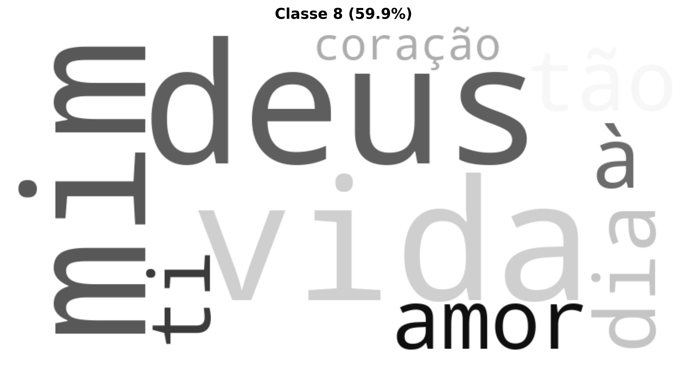

# Relatório de Análise Textual Avançada: olivrodadorabasini

Este relatório apresenta uma análise linguística e estatística abrangente da obra, utilizando técnicas avançadas de Processamento de Linguagem Natural, Machine Learning e o **Método Reinert** de Classificação Hierárquica Descendente (CHD), seguindo os padrões do software IRaMuTeQ.

---

## Método Reinert - Classificação Hierárquica Descendente (CHD)

O Método Reinert (1983, 1991) é uma técnica estatística de análise lexicométrica que identifica automaticamente classes lexicais homogêneas no corpus textual, revelando os "mundos lexicais" ou universos de sentido presentes no texto através de Classificação Hierárquica Descendente maximizando a estatística χ².

### Resultados da Classificação Hierárquica Descendente

| Classe | Percentual | Palavras |
|--------|------------|----------|
| Classe 8 (vermelho) | 59.9% | deus, vida, mim, tão, dia, à, ti, amor, coração |
| Classe 5 (verde) | 11.7% | ti, tão, noite, alma, grande, horas, lembra, ler, duas, hás, todavia, cena, deixa, injustiça, plena |
| Classe 6 (azul) | 8.8% | tenho, à, dia, nunca, tanta, porta, ninguém, conta, mente, nesse, paz, cabeça, creio, desgraçado, fatal |
| Classe 1 (amarelo) | 5.3% | vida, mulher, fim, fortes, ama, quanto, felicidade, homem, agora |
| Classe 7 (rosa) | 4.9% | amor, paixão, anos, doce, quarenta, respeito, intensidade, mata, sincero, assim, paz |
| Classe 4 (laranja) | 3.9% | deus, sinto, misericórdia, ah, falei, acredito, lar, ó, agora |
| Classe 2 (roxo) | 2.7% | tanto, dormir, vou |
| Classe 3 (marrom) | 2.7% | mim, felicidade, ainda |

### Dendrograma da CHD

O dendrograma abaixo mostra a estrutura hierárquica da classificação, ilustrando como os segmentos de texto foram agrupados:

#### Nuvem de Palavras - Classe 1

#### Nuvem de Palavras - Classe 2

#### Nuvem de Palavras - Classe 3

#### Nuvem de Palavras - Classe 4

#### Nuvem de Palavras - Classe 5

#### Nuvem de Palavras - Classe 6

#### Nuvem de Palavras - Classe 7

#### Nuvem de Palavras - Classe 8

### Análise de Similitude

A análise de similitude mostra as relações de coocorrência entre as palavras mais frequentes:

---

## Nuvem de Palavras Geral

A nuvem de palavras oferece uma visualização das palavras mais frequentes após lematização e remoção de stopwords:

---

## Interpretação Especializada (LLM)

A análise do texto fornecido, sob a ótica da análise literária e da linguística computacional, revela uma riqueza de elementos que permitem uma profunda compreensão de sua estrutura, conteúdo e contexto.

---

### Análise do Texto: Prólogo de "O Livro da Dor"

**1. Temas Centrais e Motivos Recorrentes**

O tema onipresente é a **dor** (sofrimento), que não é apenas um sentimento, mas uma força destrutiva ("prostra e que mata todos os caracteres"). Sua recorrência é explícita: "doce travo daquelas de dor sombrias", "O Livro da Dor", "A dor, sempre a dor", "horas bem amargas e de grande provação". Associada à dor, está a **melancolia** e o **spleen**, expressos na própria experiência do narrador ("tristeza enorme que de mim se apossara", "ataque de spleen").

A **morte** é outro tema central, contextualizada como a consequência do sofrimento e do amor idealizado: João Albasini "morreu novo ainda porque muito amou e muito padeceu". O **amor**, por sua vez, é retratado não como fonte de felicidade, mas como causa de grande padecimento e desenganos, uma "paixão violenta e arrebatadora que lentamente o aniquilou".

A **sinceridade** e a **integridade** moral de Albasini são motivos contrastantes com a visão cínica do mundo, onde o triunfo é dos "fortes, dos que mentem, dos que batem, dos que falseiam", resultando na sua derrota existencial. Há também a valorização da **amizade** ("verdadeiro culto de amizade", "devotado amigo") e da **lealdade** como pilares humanos.

*   **Relevância Computacional:** A identificação desses temas pode ser feita por meio de Análise de Sentimento (detectando a prevalência de emoções negativas como tristeza, angústia), Análise Lexical (frequência de termos como "dor", "morte", "amor", "padecer"), e Modelagem de Tópicos (Latent Dirichlet Allocation - LDA) para agrupar termos semanticamente relacionados e inferir os temas dominantes.

**2. Estilo Narrativo e Características Linguísticas**

O estilo é marcadamente **sentimental** e **elegíaco**, permeado por um tom formal e culto. A **subjetividade** é intensa, tanto na descrição da vida de Albasini quanto na experiência do narrador.

*   **Vocabulário:** Rico, arcaizante em alguns pontos (e.g., "espólio literário", "franqueou-me", "escrínio", "esvaíra", "spleen", "procela", "ingente", "acrisolado") e carregado de adjetivos e advérbios expressivos ("vereda sinuosa", "guia desinteressado", "desejo imenso", "dor sombrias", "alma diluída em prantos", "recordações pungentes", "alvoroçado", "áge, sofrego", "delicioso néctar", "casto e elevado sentimentalismo", "sensação aflitiva, angustiosa", "terrí vel mal", "paixão violenta e arrebatadora").
*   **Sintaxe:** Predominam frases complexas, com múltiplos períodos e orações subordinadas que constroem elaborados encadeamentos de ideias e sentimentos. Há inversões sintáticas que contribuem para a formalidade e o ritmo (e.g., "franqueou-me a sua leitura", "calar-lhes-ei a boca").
*   **Figuras de Linguagem:**
    *   **Metáforas:** "vereda sinuosa da vida", "alma diluída em prantos", "doce travo daquelas de dor sombrias", "tesouro que havia guardado", "coração de ouro", "mar de procela".
    *   **Símiles:** "como viandante que atravessando o deserto de repente se lhe depara no caminho um oásis — bebendo todo esse delicioso néctar".
    *   **Personificação:** "spleen", "tristeza enorme que de mim se apossara".
    *   **Repetição/Anáfora:** "A dor, sempre a dor" e "dias e dias" reforçam a intensidade e a continuidade dos sentimentos e do tempo.
*   **Intertextualidade:** Citações diretas de João de Deus ("Muito padece quem ama") e Júlio Dantas ("A mocidade é uma corrida ver...").

*   **Relevância Computacional:** A análise lexical pode quantificar a riqueza do vocabulário (tipo-token ratio), identificar arcaísmos, e mapear a densidade de adjetivos e advérbios. A Análise Sintática (parsing) pode quantificar a complexidade das frases (número de orações, profundidade da árvore sintática). Ferramentas de Reconhecimento de Entidades Nomeadas (NER) identificariam as figuras de linguagem e as referências intertextuais, permitindo a construção de redes semânticas e o estudo de alusões.

**3. Contexto Cultural e Social Evidenciado**

O texto revela um ambiente cultural onde o **sentimentalismo romântico e pós-romântico** ainda possui grande influência, com ênfase na introspecção, na emoção sobre a razão ("Viveu sempre actuando mais pelo coração que pelo cérebro"), na melancolia e na exaltação da figura do gênio sofredor. A referência ao "spleen" remete diretamente à sensibilidade fin-de-siècle e ao Simbolismo europeu.

A valorização do **"homem de bem"** e a lamentação de que a virtude não é recompensada na vida terrena ("Não conseguiu sair vitorioso... porque foi sempre... um sincero, um crente") aponta para uma moralidade tradicional em confronto com a dureza do mundo. A profissão de Albasini como **jornalista elegante** sugere um contexto social onde a imprensa e a literatura desempenhavam um papel significativo na vida intelectual e social.

*   **Relevância Computacional:** A análise de sentimentos e a identificação de léxicos emocionais podem quantificar o grau de sentimentalismo. A detecção de conceitos morais ("sincero", "crente", "homem de bem") e a análise de suas coocorrências com resultados negativos (derrota, sofrimento) podem iluminar os valores sociais expressos.

**4. Elementos Culturais ou Históricos Evidentes**

*   **João Albasini:** O texto é dedicado a ele, apresentando-o como um jornalista e escritor que morreu jovem, atormentado pelo amor e pela dor. Embora o texto não especifique sua atuação política, a menção de "João Albasini" (José de Almeida Albasini, 1876-1922) evoca uma figura histórica importante do modernismo moçambicano, jornalista, poeta e ativista contra o colonialismo. O foco do prólogo, contudo, é em seu perfil pessoal e emocional.
*   **João de Deus (1830-1896):** O "Poeta das Flores", poeta romântico português, cuja citação "Muito padece quem ama" é utilizada para legitimar e universalizar o sofrimento de Albasini.
*   **Júlio Dantas (1876-1962):** Médico, escritor e político português, referenciado como "grande psicólogo e eminente escritor", cujas palavras são invocadas para validar a complexidade do sentimento tardio.
*   **"Spleen":** Termo cultural e literário, popularizado por Baudelaire e os poetas simbolistas franceses, que designa um estado de melancolia profunda, tédio existencial e angústia.
*   **Período literário:** As referências a João de Deus e a Júlio Dantas, juntamente com o estilo e os temas, situam o texto no final do século XIX e início do século XX, um período de transição e coexistência de correntes românticas, parnasianas e simbolistas na literatura portuguesa.

*   **Relevância Computacional:** A Reconhecimento de Entidades Nomeadas (NER) é crucial para identificar e classificar João Albasini, João de Deus e Júlio Dantas como Pessoas (PER) e termos como "Spleen" como Entidade Cultural ou Conceito Literário. A análise cronológica das obras e vidas desses autores pode ajudar a contextualizar a datação do prólogo e suas influências.

**5. Particularidades da Escrita ou Estrutura Textual**

*   **Gênero Prólogo:** A estrutura é a de um prólogo, que serve para introduzir, contextualizar e legitimar o texto principal (que seria "O Livro da Dor"). O narrador não é o autor da obra, mas um "editor" ou "curador" que encontrou o manuscrito e se propõe a apresentá-lo.
*   **Narrador-Personagem e Narrador-Editor:** O texto apresenta um narrador que é uma figura dentro da narrativa (o "eu" que encontra os escritos, sofre de spleen, e se emociona) e, simultaneamente, um editor que comenta e explica a gênese da obra (a mudança de título, as citações de outros autores).
*   **Meta-narrativa:** A discussão sobre o título da obra de Albasini ("A Farra do Destino" para "O Livro da Dor") é um elemento meta-narrativo, onde o próprio ato de nomear e classificar a literatura é discutido dentro do texto.
*   **In Media Res (implícito):** O final abrupto ("A mocidade é uma corrida ver...") sugere que este prólogo é, ele próprio, um fragmento de um texto maior, deixando uma sensação de continuidade e incompletude.
*   **Discurso Direto e Indireto:** Alternância entre a voz do narrador e a inserção de citações diretas, tanto do próprio Albasini ("como ele próprio o afirma") quanto de outros autores.

*   **Relevância Computacional:** A identificação da estrutura do prólogo pode ser automatizada pela análise de marcadores textuais e pela classificação de tipos de parágrafos. A distinção entre as vozes narrativas (narrador principal vs. citações) pode ser feita por técnicas de Atribuição de Autoria ou Classificação de Discurso. A análise do fluxo de informações e a identificação de elementos meta-textuais (como a discussão do título) podem ser auxiliadas por algoritmos de extração de informação e ontologias literárias. A detecção da incompletude final é um desafio que poderia envolver a análise de padrões de encerramento de textos.

---

Em suma, o texto é um exemplar rico de prosa literária do início do século XX, que oferece vasto material para a aplicação de ferramentas de linguística computacional, desde a análise de sentimentos e léxico até a identificação de entidades nomeadas e padrões sintáticos, permitindo uma compreensão multifacetada de seu conteúdo e contexto.

---

## Análise de Sentimentos

- **Polaridade:** -0.029 (Neutro)
- **Subjetividade:** 0.714 (Subjetivo)

A polaridade varia de -1 (muito negativo) a +1 (muito positivo). A subjetividade varia de 0 (objetivo) a 1 (subjetivo).
---

## Modelagem de Tópicos LDA (Complementar)

Além das classes Reinert, a modelagem LDA identifica tópicos latentes baseados em coocorrências:

Erro na modelagem de tópicos: cannot compute LDA over an empty collection (no terms)

---

## Análise de Clustering

**Cluster 1:** homem, mulher, lutar, vida, paraíso, eva, noite, miserável, beijo, verdade
**Cluster 2:** acreditar, ódio, bilhete, perceber, sábado, algum, enfim, alma, crime, julgar
**Cluster 3:** deus, dor, hora, coração, sentir, dia, destino, vida, acabar, albasini
**Cluster 4:** dia, alto, oráculo, passado, beber, obra, palavra, viver, ventura, mente
**Cluster 5:** vida, mulher, amor, paz, certo, casa, carinho, situação, vontade, respeito

---

## Entidades Nomeadas (NER)

### Estatísticas por Tipo de Entidade
- **PER:** 86 ocorrências
- **LOC:** 56 ocorrências
- **MISC:** 48 ocorrências
- **ORG:** 9 ocorrências

### Top 25 Entidades Mais Mencionadas
| Tipo   | Entidade                                    |   Contagem |
|:-------|:--------------------------------------------|-----------:|
| PER    | Deus                                        |          9 |
| MISC   | Mulher                                      |          4 |
| PER    | João Albasini                               |          4 |
| MISC   | Jeová                                       |          3 |
| ORG    | Igreja                                      |          3 |
| PER    | Voltarei                                    |          2 |
| MISC   | Ah!                                         |          2 |
| PER    | Homem                                       |          2 |
| MISC   | Ai!                                         |          2 |
| PER    | Jesus                                       |          2 |
| MISC   | Avó                                         |          2 |
| MISC   | Avó!                                        |          2 |
| LOC    | Lembra-Me                                   |          2 |
| LOC    | Julgo                                       |          2 |
| MISC   | Deus!                                       |          2 |
| PER    | Paraíso                                     |          2 |
| PER    | Eva                                         |          2 |
| PER    | Adão                                        |          2 |
| PER    | Albino Forjaz De Sampaio — Palavras Cínicas |          1 |
| PER    | A. B. C.                                    |          1 |
| PER    | Estarei                                     |          1 |
| PER    | Epicuro                                     |          1 |
| PER    | Dormi                                       |          1 |
| MISC   | Vivesses                                    |          1 |
| PER    | Destino                                     |          1 |

---

## Estatísticas Gerais

- **Total de tokens processados:** 2,629
- **Vocabulário único:** 1,585
- **Densidade lexical:** 0.603

---

**Relatório gerado automaticamente com técnicas avançadas de Processamento de Linguagem Natural (NLP), Machine Learning (ML) e Método Reinert (CHD).**

**Tecnologias Utilizadas:** Método Reinert (1983, 1991), Modelos de Linguagem (LLM), Processamento e Análise Documental, Interfaces de Programação de IA, Processamento de Linguagem Natural (PLN), Aprendizado de Máquina e Mineração de Dados, Geração de Visualizações e Gráficos, Análise Estatística Avançada, Ferramentas de Produtividade, Análise Textual Aprofundada, Computação Paralela e Distribuída, e Estruturação de Relatórios Técnicos.

---

## Consultoria

David C Cavalcante

AI ML Engineer | Researcher Scientist | LLM Philosopher

- Email: [davcavalcante@proton.me](mailto:davcavalcante@proton.me)
- LinkedIn: [David C Cavalcante](https://linkedin.com/in/hellodav)
